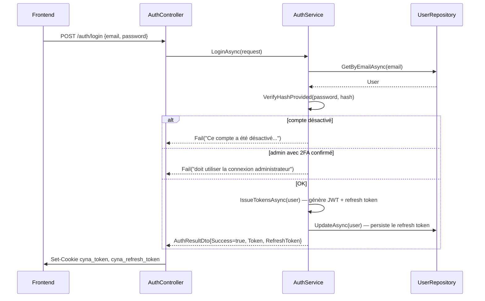
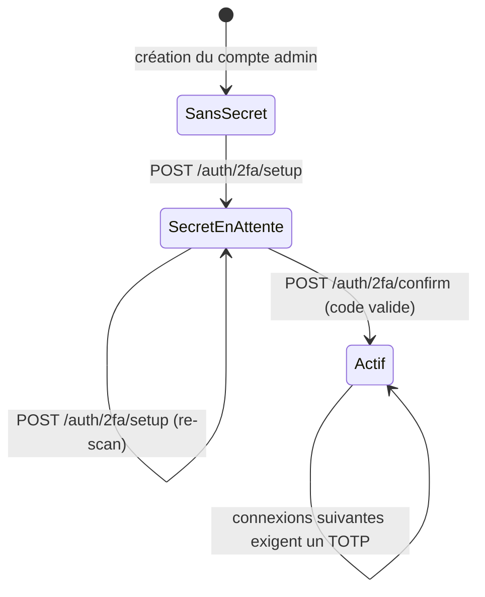
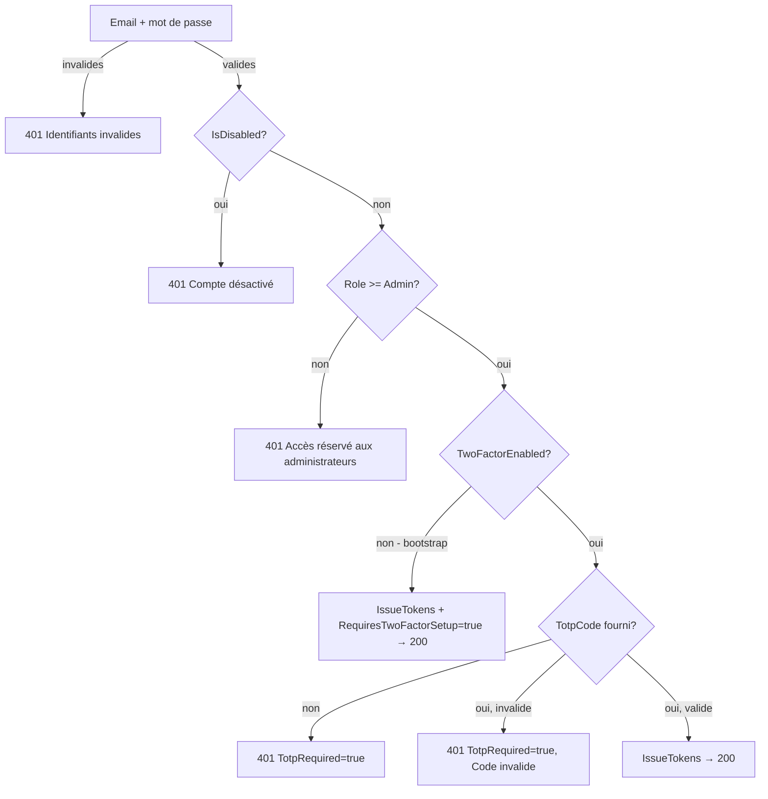

# Authentification, JWT & 2FA Admin — Cyna API

## 🎯 Objectif du document

Détailler le fonctionnement complet de l'authentification : émission/validation des JWT via cookies HttpOnly, cycle de vie du refresh token, et le mécanisme de double authentification (2FA/TOTP) réservé aux comptes administrateurs, y compris son **mode bootstrap** qui évite tout risque de verrouillage de compte.

---

## 🔐 1. Principe général

* Les jetons sont transmis via **cookies `HttpOnly`** (pas de `localStorage`), ce qui protège contre le vol de token par XSS.
* Deux cookies sont posés à chaque connexion réussie :

| Cookie | Contenu | Durée de vie | Usage |
|---|---|---|---|
| `cyna_token` | Access token JWT | 15 minutes | Authentification des requêtes API (`Authorization` résolu automatiquement depuis le cookie) |
| `cyna_refresh_token` | Chaîne aléatoire opaque (base64, 64 octets) | 1440 minutes (24h) | Renouvellement de l'access token via `POST /auth/refresh` |

* `SameSite=Strict`, `Path=/`. **`Secure=false` en l'état actuel du code** (`AuthController.GetCookieOptions`) — à passer impérativement à `true` derrière HTTPS en production (commentaire explicite dans le code : `// Set to true in production (HTTPS)`).

---

## 🧾 2. Configuration JWT (`AuthExtensions.AddJwtAuth`)

```csharp
options.MapInboundClaims = false;              // conserve les noms de claims tels qu'émis (pas de remapping .NET)
options.TokenValidationParameters = new()
{
    ValidateIssuer = true,
    ValidateAudience = true,
    ValidateLifetime = true,
    ValidateIssuerSigningKey = true,
    ValidIssuer = jwtConfig.Issuer,
    ValidAudience = jwtConfig.Audience,
    IssuerSigningKey = new SymmetricSecurityKey(keyBytes),
    ClockSkew = TimeSpan.Zero,                  // pas de tolérance sur l'expiration
    RoleClaimType = "role"                      // le rôle est lu depuis le claim custom "role"
};
options.Events.OnMessageReceived = ctx =>
{
    var token = ctx.Request.Cookies["cyna_token"];
    if (!string.IsNullOrEmpty(token)) ctx.Token = token;
    return Task.CompletedTask;
};
```

Le token n'est **jamais** lu depuis l'en-tête `Authorization` côté navigateur : c'est l'événement `OnMessageReceived` qui l'extrait du cookie `cyna_token` pour le réinjecter dans le pipeline JWT Bearer. Swagger/Scalar conserve toutefois la possibilité de tester avec un header `Authorization: Bearer ...` manuel (`AddSecurityDefinition`).

### Policy `AdminOnly`

```csharp
services.AddAuthorizationBuilder()
    .AddPolicy("AdminOnly", policy =>
        policy.RequireRole("Administrateur", "Super Administrateur"));
```

⚠️ Les rôles vérifiés sont les **libellés `[Description]`** de l'enum `UserRole` (`Tools/Enums.cs`), pas les noms C# (`Admin`, `SuperAdmin`). C'est cohérent avec `JwtTokenGenerator` qui émet `user.Role.GetEnumDescription()` dans le claim `role`. À retenir si un nouveau rôle est ajouté : il faut lui donner un `[Description]` explicite et l'ajouter à la policy si nécessaire.

### Génération du token (`JwtTokenGenerator`)

Claims émis : `id`, `firstName`, `lastName`, `email`, `role` (description du rôle). Durée de validité pilotée par `JwtOptions.ExpiresInMinutes` (config), indépendamment de la durée du cookie (15 min côté `AuthController`) — **à garder synchronisé** pour éviter qu'un token reste valide après l'expiration du cookie ou inversement.

---

## 🔄 3. Flux standard (utilisateur non-admin)



### Endpoints

| Route | Méthode | Auth requise | Description |
|---|---|---|---|
| `/auth/login` | POST | Non | Connexion standard. Refusée si `IsDisabled` ou si l'utilisateur est admin **avec 2FA confirmé** (`TwoFactorEnabled == true`). |
| `/auth/register` | POST | Non | Création de compte (`UserRole.User`), envoi d'un OTP de vérification email. |
| `/auth/refresh` | POST | Cookie `cyna_refresh_token` | Vérifie l'expiration (`RefreshTokenExpiryTime`) et `IsDisabled`, ré-émet les deux tokens. |
| `/auth/logout` | POST | Cookie | Invalide le refresh token en base (`RefreshToken = null`) et supprime les cookies. |
| `/auth/me` | GET | JWT | Retourne les claims du token décodé (pas de requête BDD). |
| `/auth/forgot-password` | POST | Non | Voir `02-Email-OTP.md` |
| `/auth/reset-password` | POST | Non | Voir `02-Email-OTP.md` |
| `/auth/confirm-email` | POST | Non | Voir `02-Email-OTP.md` |
| `/auth/admin/login` | POST | Non | Connexion admin "bootstrap-aware" — voir section 4 |
| `/auth/2fa/setup` | POST | JWT (`[Authorize]`) | Génère un secret TOTP pour l'utilisateur connecté |
| `/auth/2fa/confirm` | POST | JWT (`[Authorize]`) | Confirme l'activation du 2FA avec un premier code valide |

---

## 🛡️ 4. Double authentification (2FA / TOTP) — comptes admin

### Pourquoi une distinction `TwoFactorSecret` / `TwoFactorEnabled` ?

L'entité `User` porte **deux champs distincts**, et c'est le point de conception le plus important du module :

| Champ | Rôle |
|---|---|
| `TwoFactorSecret` (`string?`) | Clé TOTP générée par `/auth/2fa/setup`. Peut exister **sans** que le 2FA soit actif. |
| `TwoFactorEnabled` (`bool`) | **Seul** flag qui bloque la connexion standard et exige un code TOTP sur `/auth/admin/login`. Ne devient `true` que dans `ConfirmTwoFactorAsync`, après vérification d'un premier code valide. |

> 🚫 **Règle absolue du code** (commentée explicitement dans `User.cs` et `AuthService.cs`) : la simple présence d'un secret ne doit **jamais** bloquer la connexion. Sinon, un admin qui lance `/auth/2fa/setup` puis abandonne (scan QR raté, fermeture d'onglet) se retrouverait **verrouillé hors de son propre compte**. C'est pourquoi `SetupTwoFactorAsync` peut être rappelée indéfiniment sans risque : elle écrase le secret en attente, sans toucher à `TwoFactorEnabled`.

### Diagramme d'état du compte admin



Tant que l'état est `SansSecret` ou `SecretEnAttente`, **`/auth/login` standard reste utilisable** pour un admin (le check dans `LoginAsync` ne porte que sur `TwoFactorEnabled`).

### Logique de `/auth/admin/login` (`AdminLoginWithTwoFactorAsync`)



Trois sorties possibles côté frontend, distinguées **sans avoir à parser le message d'erreur** :

1. **`Success=true, RequiresTwoFactorSetup=true`** → l'admin est authentifié (tokens émis) mais **doit** être redirigé immédiatement vers la page de configuration 2FA. Le compte reste vulnérable jusqu'à confirmation.
2. **`Success=false, TotpRequired=true`** → identifiants corrects, code TOTP manquant ou invalide. Le frontend affiche/maintient le champ de saisie du code (pas un retour à l'étape mot de passe).
3. **`Success=false, TotpRequired=false`** → mauvais identifiants, compte désactivé ou rôle insuffisant → retour à l'étape 1.

### TOTP (`Tools/TotpHelper`, package `Otp.NET`)

* `GenerateSecret()` : clé 160 bits encodée en base32.
* `BuildOtpAuthUrl(email, secret, issuer="Cyna")` : URL `otpauth://` à encoder en QR code côté frontend (compatible Google Authenticator / Authy).
* `Verify(secret, code)` : fenêtre de tolérance `±1` période (30s) pour compenser la dérive d'horloge — algorithme RFC 6238, SHA1, 6 chiffres, période 30s.

### Pourquoi le login standard (`/auth/login`) refuse les admins avec 2FA actif ?

```csharp
if (user.Role >= UserRole.Admin && user.TwoFactorEnabled)
    return Fail("Les comptes administrateur avec 2FA activé doivent utiliser la connexion administrateur.");
```

Cela force tout admin "complètement configuré" à passer par le flux 2FA — évite un contournement de la double authentification via la route grand public.

---

## 🧰 5. Helpers transverses liés à l'authentification

| Helper | Fichier | Rôle |
|---|---|---|
| `ClaimsHelper.GetUserId(User)` | `Tools/ClaimsHelper.cs` | Extrait l'ID utilisateur du `ClaimsPrincipal` (`id`, sinon `NameIdentifier`, sinon `sub`). Lève `UnauthorizedAccessException` sinon. |
| `HashExstension.GetHash()` / `VerifyHashProvided()` | `Tools/HashExstension.cs` | Hash/vérification de mot de passe via `PasswordHasher<object>` (ASP.NET Identity), utilisé sans dépendre d'un vrai store Identity. |
| `EnumExtensions.GetEnumDescription()` | `Tools/EnumExtensions.cs` | Lit l'attribut `[Description]` d'un enum — utilisé pour le claim `role` et l'affichage des rôles côté admin. |

---

## ⚠️ 6. Points d'attention / dette technique identifiée

* **`Secure=false`** sur les cookies (`AuthController.GetCookieOptions`) — doit être basculé à `true` en production (HTTPS obligatoire).
* **Durée du token JWT** (`JwtOptions.ExpiresInMinutes`, config) doit rester cohérente avec la durée du cookie `cyna_token` (15 min, codée en dur dans `AuthController.AppendAuthCookies`).
* La route `Api/Controllers/debug.cs` (`GET /debug-claims`, `[AllowAnonymous]`) expose les claims du `ClaimsPrincipal` courant. Utile en développement, **à exclure explicitement de la build de production** (pas de garde d'environnement dans le code actuel).
* `AuthService` est injecté à la fois comme classe concrète et comme interface (voir `00-Architecture-Generale.md`) — point de couplage à surveiller en cas de refactorisation des tests.

---

## 🔗 Documents liés

* `00-Architecture-Generale.md`
* `02-Email-OTP.md` (OTP de vérification email / reset mot de passe — différent du TOTP admin)
* `03-Gestion-Utilisateurs.md`