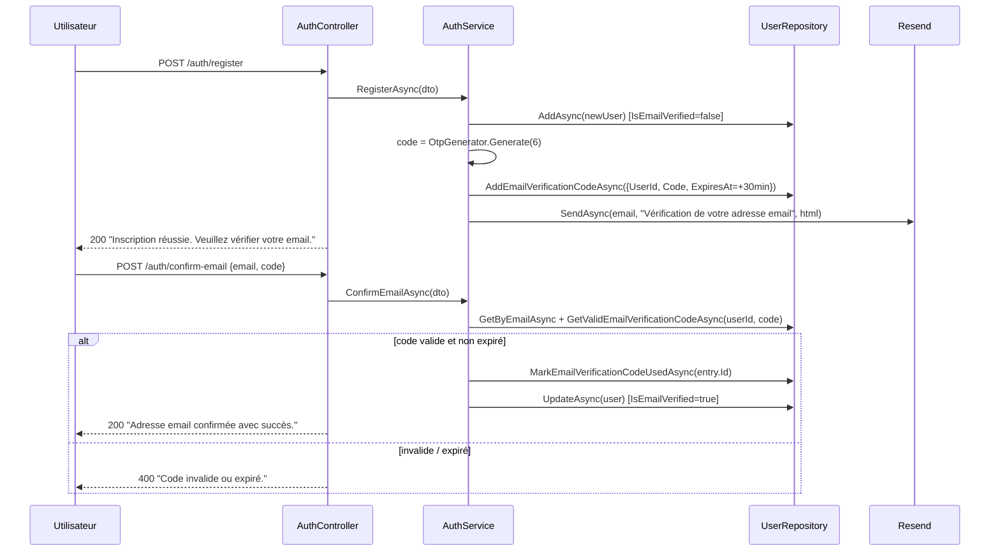
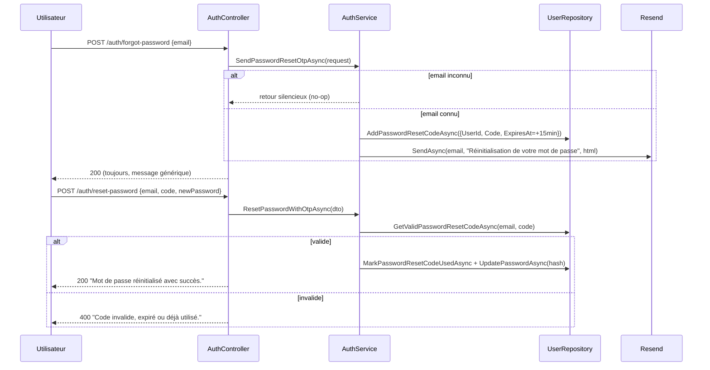

# Emails & Codes OTP — Cyna API

## 🎯 Objectif du document

Décrire l'envoi d'emails transactionnels (fournisseur **Resend**) et les deux mécanismes de code à usage unique (OTP) **distincts du TOTP admin** (voir `01-Authentification-JWT-2FA.md`) : vérification d'adresse email et réinitialisation de mot de passe.

> ℹ️ **Ne pas confondre** : l'OTP (`OtpGenerator`, 6 chiffres numériques, stocké en base avec expiration) sert à la vérification d'email et au reset de mot de passe pour **tous les utilisateurs**. Le TOTP (`TotpHelper`, RFC 6238) sert uniquement à la **double authentification des comptes admin**.

---

## 📬 1. Fournisseur d'email : Resend

### Configuration (`AppServicesExtensions.AddAppServices`)

```csharp
services.AddOptions();
services.AddHttpClient<ResendClient>();
services.Configure<ResendClientOptions>(o => o.ApiToken = config["Resend:ApiKey"]!);
services.AddTransient<IResend, ResendClient>();
services.AddTransient<EmailHelper>();
```

* Clé d'API attendue dans la configuration sous `Resend:ApiKey` (variable d'environnement ou `appsettings.*.json`, **jamais committée**).
* Adresse d'expéditeur par défaut : `Resend:From`, avec fallback `no-reply@projet-cyna.fr` (`EmailHelper` constructeur).

### `EmailHelper` (`Tools/EmailHelper.cs`)

Deux méthodes principales :

| Méthode | Usage |
|---|---|
| `SendAsync(to, subject, htmlBody, attachments, from?, ct)` | Envoi à **un seul destinataire** — c'est la méthode utilisée par tous les flux OTP. |
| `SendBatchAsync(recipients, subject, htmlBody, attachments, mode, from?, ct)` | Envoi à plusieurs destinataires, avec deux stratégies : `SingleEmailAllRecipients` (tous en `To`, un seul appel API) ou `OneEmailPerRecipient` (un appel par destinataire, isolation des destinataires). Non utilisé actuellement par les flux d'authentification, mais disponible pour de futurs cas d'usage (newsletters, notifications de masse). |

---

## 🔢 2. Génération des codes OTP (`Tools/OtpGenerator.cs`)

```csharp
public static string Generate(int digits = 6)
{
    var max = (int)Math.Pow(10, digits);
    var value = RandomNumberGenerator.GetInt32(max);   // RNG cryptographique
    return value.ToString().PadLeft(digits, '0');
}
```

* Utilise `System.Security.Cryptography.RandomNumberGenerator` (pas `Random`) — génération **cryptographiquement sûre**.
* Format : 6 chiffres, zéro-paddés (`"007123"` est valide).

---

## ✉️ 3. Flux de vérification d'adresse email

### Déclenchement

1. **À l'inscription** (`AuthService.RegisterAsync`) : un nouvel utilisateur est créé avec `IsEmailVerified = false`, puis `SendEmailVerificationOtpInternalAsync(newUser)` est appelée immédiatement.
2. **Au changement d'email** (`UserService.UpdateProfileAsync`) : si l'email diffère de l'email actuel (comparaison insensible à la casse), `IsEmailVerified` repasse à `false` et un nouvel OTP est envoyé via `_authService.SendEmailVerificationOtpInternalAsync(user)`.

> C'est la raison de l'injection de la classe concrète `AuthService` dans `UserService` (voir `00-Architecture-Generale.md`) : cette méthode n'est pas exposée par `IAuthService`.

### Séquence



### Détails techniques

* **Expiration** : 30 minutes (`ExpiresAt = DateTime.UtcNow.AddMinutes(30)`).
* **Anti-réutilisation** : `IsUsed` passe à `true` via `MarkEmailVerificationCodeUsedAsync` dès validation — un code consommé ne peut pas être réutilisé même s'il n'est pas encore expiré.
* **Sélection du code valide** : `GetValidEmailVerificationCodeAsync` filtre sur `UserId`, `Code`, `!IsUsed`, `ExpiresAt > UtcNow`, trié par `ExpiresAt` décroissant (le plus récent en cas de demandes multiples).

---

## 🔑 4. Flux de réinitialisation de mot de passe (OTP)

### Anti-énumération d'emails

```csharp
public async Task SendPasswordResetOtpAsync(ForgotPasswordRequestDto request)
{
    var user = await _userRepository.GetByEmailAsync(request.Email);
    if (user is null) return;  // ⚠️ sortie silencieuse — pas d'erreur 404
    ...
}
```

Le contrôleur retourne **systématiquement** `200 OK` avec le message générique *"Si cet email est enregistré, un code de réinitialisation a été envoyé."*, que l'email existe ou non. Cela empêche un attaquant de déduire quels emails sont enregistrés en observant les codes de réponse.

### Séquence



### Détails techniques

* **Expiration** : 15 minutes — volontairement plus courte que l'OTP de vérification email (30 min), car le reset de mot de passe est une opération plus sensible.
* `ResetPasswordWithOtpDto.NewPassword` requiert un minimum de **8 caractères** (`[MinLength(8)]`), contre **6 caractères** pour `RegisterRequestDto.Password` — incohérence mineure à harmoniser si une politique de mot de passe unique est souhaitée.
* Le nouveau mot de passe est haché via `HashExstension.GetHash()` (voir `01-Authentification-JWT-2FA.md`) avant persistance.

---

## 🎨 5. Gabarit HTML des emails (`AuthService.BuildOtpEmailHtml`)

Template commun aux deux flux OTP (vérification email et reset de mot de passe), paramétré par `firstName`, `code`, `title`, `body` :

* HTML autonome (`<!DOCTYPE html>`), largeur max 480px, police sans-serif.
* Le code est affiché en grand (`font-size:36px`), espacé (`letter-spacing:8px`), sur fond gris clair — optimisé pour la lecture/recopie rapide sur mobile.
* Mention de sécurité standard en pied de mail : *"Si vous n'êtes pas à l'origine de cette demande, ignorez cet email."*

---

## ⚠️ 6. Points d'attention

* **Pas de purge automatique** des codes OTP expirés/utilisés en base (`EmailVerificationCodes`, `PasswordResetCodes` grossissent indéfiniment). À considérer pour une tâche de nettoyage périodique (job planifié) si le volume devient significatif.
* **Pas de limitation de débit (rate limiting)** visible sur `/auth/forgot-password` ou `/auth/register` : un attaquant pourrait déclencher l'envoi répété d'emails vers une même adresse. À évaluer côté reverse proxy / middleware dédié.
* Les deux durées d'expiration (15 min / 30 min) sont codées en dur dans `AuthService` — pourraient être externalisées en configuration si elles doivent évoluer sans redéploiement.

---

## 🔗 Documents liés

* `01-Authentification-JWT-2FA.md`
* `03-Gestion-Utilisateurs.md`