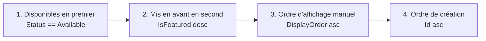

# Catalogue & Recherche Produits — Cyna API

## 🎯 Objectif du document

Expliquer les deux points d'entrée publics de navigation produit — **`CatalogController`** (navigation par catégorie) et **`SearchController`** (recherche globale) — ainsi que l'algorithme de tri métier **"Catalog Priority"** et le calcul du prix d'appel affiché sur les cartes produit.

---

## 🗂️ 1. Différence entre Catalogue par catégorie et Recherche globale

| | `CatalogController` (`/Catalog/category/{slug}`) | `SearchController` (`/Search`) |
|---|---|---|
| Portée | Une seule catégorie (identifiée par son slug) | Tout le catalogue, filtrable par plusieurs catégories |
| Données renvoyées | Produits **+** en-tête de la catégorie (nom, description, image bannière) | Produits uniquement |
| Tri | Fixe et non paramétrable ("Catalog Priority") | Paramétrable (`sortBy`) |
| DTO de réponse | `CategoryCatalogPageDto` (hérite de `CatalogPageDto`) | `CatalogPageDto` |
| Cas d'usage frontend | Page "catégorie" avec bannière | Barre de recherche globale, filtres multi-critères |

---

## 🏷️ 2. `CatalogController` — Catalogue par catégorie

### Route

`GET /Catalog/category/{slug}?q=&maxPrice=&available=&page=&pageSize=&locale=`

### Validation côté contrôleur

* `page >= 1` sinon `400`.
* `1 <= pageSize <= 100` sinon `400`.
* Catégorie introuvable pour le `slug` → `CatalogService` lève `KeyNotFoundException`, intercepté → `404`.

### Algorithme de tri "Catalog Priority" (`CatalogRepository.GetCategoryCatalogAsync`)

Le tri est **rigide**, non paramétrable par le client, appliqué dans cet ordre exact :



```csharp
query = query
    .OrderByDescending(p => p.Status == ProductStatus.Available)
    .ThenByDescending(p => p.IsFeatured)
    .ThenBy(p => p.DisplayOrder)
    .ThenBy(p => p.Id);
```

> 📌 Ce tri garantit une expérience cohérente : les produits achetables apparaissent toujours avant les produits indisponibles, indépendamment des filtres `q`/`maxPrice`/`available` appliqués en amont.

### Filtres optionnels (cumulables avec le tri ci-dessus)

| Paramètre | Effet SQL |
|---|---|
| `q` | `Translations.Any(Name OR Description contains q)`, insensible à la casse |
| `maxPrice` | Au moins un plan **mensuel** dont un palier a `PricePerUnit <= maxPrice` |
| `available` | Filtre strict `Status == Available` (en plus du tri qui les remonte déjà) |

---

## 🔎 3. `SearchController` — Recherche globale

### Route

`GET /Search?q=&categoryIds=&maxPrice=&available=&sortBy=&page=&pageSize=&locale=`

### Paramètres de tri (`sortBy`)

| Valeur | Comportement (`SearchRepository.GetProductsAsync`) |
|---|---|
| `relevance` (défaut) | `IsFeatured` décroissant, puis `Id` croissant |
| `price_asc` | `IsFeatured` décroissant, puis prix minimum (palier mensuel) croissant — `decimal.MaxValue` si aucun palier (relégué en fin de liste) |
| `price_desc` | `IsFeatured` décroissant, puis prix minimum décroissant — `decimal.Zero` si aucun palier |
| `name` | `IsFeatured` décroissant, puis nom (première traduction) alphabétique |

> Notez que **`IsFeatured` prime toujours** sur le critère de tri demandé, y compris en mode `price_asc`/`price_desc` — les produits mis en avant restent prioritaires même en tri par prix.

### Filtrage multi-catégories

`categoryIds` est une chaîne CSV (`"1,4,7"`), parsée et nettoyée côté `SearchService` :

```csharp
var catIdList = categoryIds?
    .Split(',', StringSplitOptions.RemoveEmptyEntries)
    .Select(s => int.TryParse(s.Trim(), out var id) ? (int?)id : null)
    .Where(id => id.HasValue)
    .Select(id => id!.Value)
    .ToList();
```

Les segments non numériques sont silencieusement ignorés (pas d'erreur 400) — comportement tolérant pour le frontend.

---

## 💰 4. Calcul du prix affiché ("prix d'appel")

Le prix exposé sur les cartes produit (`ProductDto.Price`) est calculé de manière **identique** dans `CatalogService` et `SearchService` :

```csharp
Price = p.PricingPlans
    .SelectMany(pp => pp.PricingTiers.Select(t => new {
        Price = t.PricePerUnit * (1 - pp.DiscountPercent / 100m)
    }))
    .Select(x => x.Price)
    .DefaultIfEmpty(0)
    .Min()
```

C'est-à-dire : **le prix unitaire le plus bas, parmi tous les paliers de tous les plans tarifaires, après application de la remise du plan (`DiscountPercent`)**. C'est un prix "à partir de", pas le prix d'un palier spécifique commandé.

> ⚠️ Ce calcul parcourt **tous** les plans (mensuel, annuel, à vie confondus) et **tous** les paliers — contrairement au filtre `maxPrice` qui ne regarde que les plans **mensuels**. Une incohérence est possible : un produit peut être filtré comme "sous le budget mensuel" (`maxPrice`) mais afficher un prix calculé sur un autre plan (ex. annuel) si celui-ci est moins cher. À clarifier si un comportement strictement aligné est attendu.

---

## 📄 5. Pagination — convention commune

Tous les endpoints listant des produits/catégories partagent la même convention :

```json
{
  "total": 42,
  "page": 1,
  "pageSize": 9,
  "totalPages": 5,
  "items": [...]
}
```

* `page` base 1.
* `totalPages = Math.Max(1, Ceiling(total / pageSize))` — toujours au moins 1 page, même si `total == 0`.
* Les bornes (`page < 1`, `pageSize` hors `[1, 100]`) sont validées **au niveau du contrôleur**, avant tout appel au service — fail-fast.

---

## 🔗 Documents liés

* `Docs/CatalogCategory-page.md` *(document historique, complémentaire)*
* `05-Panier-Commandes.md` (mêmes structures `PricingPlan`/`PricingTier`)
* `06-Categories.md`