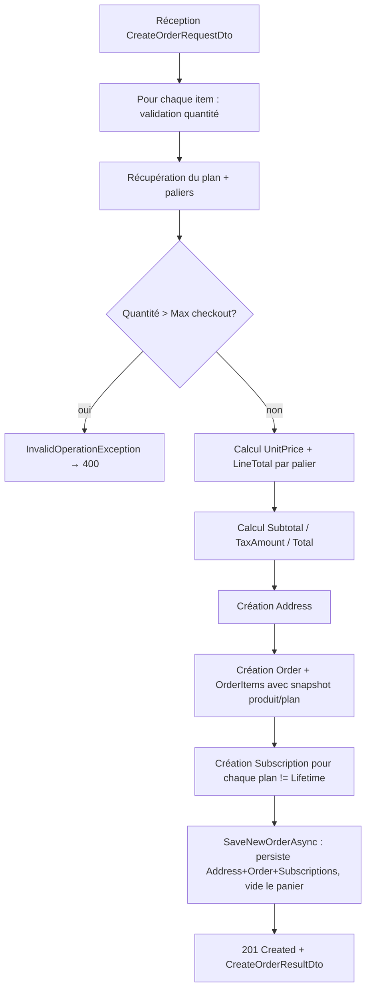

# Panier & Commandes — Cyna API

## 🎯 Objectif du document

Détailler la logique de tarification par paliers dégressifs, le cycle panier → commande → abonnement, et les protections appliquées à l'historique de commandes (suppression restreinte).

---

## 🛒 1. Panier (`CartController` / `CartService`)

### Route unique

`POST /cart` (`[Authorize]`) — ajoute un article ou met à jour les quantités si le plan tarifaire est déjà présent (upsert sur `userId + pricingPlanId`).

### Règle de validation

```csharp
if (dto.QuantityUsers == 0 && dto.QuantityDevices == 0)
    throw new ArgumentException("Au moins une quantité (utilisateurs ou appareils) doit être supérieure à zéro.");
```

→ `400 BadRequest`. Si le `PricingPlanId` n'existe pas → `KeyNotFoundException` → `404`.

### Tarification par paliers (`PricingTier`)

Chaque `PricingPlan` possède une liste de `PricingTier`, chacun défini par :

* `unitType` : `User` ou `Device` (enum `BillingUnit`).
* `minQuantity` / `maxQuantity` : plage de quantité couverte.
* `PricePerUnit` : prix unitaire applicable dans cette plage.

```csharp
private static PricingTier? FindTier(IEnumerable<PricingTier> tiers, BillingUnit unitType, int quantity)
{
    if (quantity <= 0) return null;
    return tiers.FirstOrDefault(t =>
        t.unitType == unitType &&
        quantity >= t.minQuantity &&
        quantity <= t.maxQuantity);
}
```

Le total de la ligne panier est :

```
LineTotal = UnitPriceUsers × QuantityUsers + UnitPriceDevices × QuantityDevices
```

Avec `UnitPriceUsers`/`UnitPriceDevices` = `PricePerUnit` du palier correspondant à la quantité demandée (`0` si aucune quantité de ce type, ou si aucun palier ne couvre la quantité demandée — cas à surveiller : une quantité hors paliers définis renvoie silencieusement un prix de `0`, sans erreur).

### Récapitulatif financier (`CartSummaryDto`)

Le sous-total panier est recalculé sur **l'ensemble des articles du panier** (pas seulement celui qui vient d'être ajouté) :

```csharp
var allItems  = await _cartRepository.GetCartItemsAsync(userId);
var subtotal  = allItems.Sum(ci => CalculateLineTotal(ci.PricingPlan, ci.QuantityUsers, ci.QuantityDevices));
var taxAmount = subtotal * TaxRate;   // TaxRate = 0.20m (TVA 20%)
```

### Paiement (mock)

```csharp
StripeClientSecret = $"pi_mock_{Guid.NewGuid()}_secret_mock"
```

⚠️ **Aucune intégration Stripe réelle** n'est faite à ce stade — le `client_secret` est un identifiant factice. La création de l'`Order` (étape suivante) accepte directement un `StripePaymentIntentId` fourni par le frontend, **sans vérification serveur de paiement effectif**. C'est un point à sécuriser avant mise en production réelle (webhook Stripe de confirmation de paiement, vérification côté serveur du montant).

---

## 📦 2. Commande (`OrderController` / `OrderService`)

### Route unique

`POST /orders` (`[Authorize]`) — transforme le panier (ou plus précisément la liste d'articles soumise dans le payload) en commande persistée.

### Étapes de `CreateOrderAsync`



### Seuil de commande directe (checkout threshold)

```csharp
var maxUsers   = plan.PricingTiers.Where(t => t.unitType == BillingUnit.User)  .Select(t => t.maxQuantity).DefaultIfEmpty(0).Max();
var maxDevices = plan.PricingTiers.Where(t => t.unitType == BillingUnit.Device).Select(t => t.maxQuantity).DefaultIfEmpty(0).Max();

if (item.QuantityUsers > maxUsers || item.QuantityDevices > maxDevices)
    throw new InvalidOperationException("Quote required for one or more items.");
```

Au-delà de la quantité maximale couverte par les paliers définis pour le plan (`MaxUsersCheckout`/`MaxDevicesCheckout` au niveau du `PricingPlan`, voir `Docs/ProductAdmin-CRUD.md`), la commande directe en ligne est refusée — le client doit passer par une demande de devis (non implémentée dans cette API, logique à porter par le frontend/commercial).

### Snapshot des données au moment de la commande

`OrderItem` stocke des **copies figées** (`ProductNameSnapshot`, `PlanNameSnapshot`, `UnitPriceUsers`, `UnitPriceDevices`) plutôt que de référencer dynamiquement le produit/plan actuels. **Raison** : si le produit est renommé ou si ses tarifs évoluent après la commande, l'historique de facturation reste fidèle au moment de l'achat.

### Création des abonnements

```csharp
var subscriptions = lines
    .Where(l => l.Plan.BillingPeriod != BillingPeriod.Lifetime)
    .Select(l => new Subscription
    {
        Status             = SubscriptionStatus.Active,
        CurrentPeriodStart = DateTime.UtcNow,
        CurrentPeriodEnd   = l.Plan.BillingPeriod == BillingPeriod.Yearly
                             ? DateTime.UtcNow.AddYears(1)
                             : DateTime.UtcNow.AddMonths(1),
        AutoRenew          = true,
    });
```

Seuls les plans **Mensuel** ou **Annuel** génèrent un abonnement ; un plan **À vie** (`Lifetime`) ne crée aucun `Subscription` (achat unique, pas de renouvellement). Le statut est posé directement à `Active` et `Order.Status` à `Paid` — cohérent avec l'absence de vérification de paiement réelle mentionnée plus haut : **la commande est considérée payée dès sa création**.

### Persistance (`OrderRepository.SaveNewOrderAsync`)

Trois `SaveChangesAsync()` successifs (adresse, puis commande, puis abonnements), suivis d'une suppression en masse du panier (`ExecuteDeleteAsync`) — **pas de transaction explicite** englobant ces étapes. En cas d'échec partiel (ex. crash après la création de la commande mais avant la suppression du panier), le panier pourrait rester non vidé alors que la commande existe déjà. À surveiller / à envelopper dans une transaction EF Core (`BeginTransactionAsync`) si la fiabilité transactionnelle devient critique.

---

## 📜 3. Historique (`UserController` — `/user/orders`, `/user/subscriptions`)

Lecture simple, triée par date décroissante (`OrderRepository.GetByUserIdAsync`) / par fin de période décroissante (`SubscriptionRepository.GetByUserIdAsync`). Inclut le lien PDF de facture si disponible (`Invoices.FirstOrDefault()?.PdfUrl`).

---

## 🔒 4. Protection contre la suppression de données référencées

Les migrations EF Core configurent `DeleteBehavior.Restrict` sur les relations critiques :

```csharp
mb.Entity<OrderItem>().HasOne(oi => oi.Product)...OnDelete(DeleteBehavior.Restrict);
mb.Entity<OrderItem>().HasOne(oi => oi.PricingPlan)...OnDelete(DeleteBehavior.Restrict);
mb.Entity<Subscription>().HasOne(s => s.Product)...OnDelete(DeleteBehavior.Restrict);
mb.Entity<Subscription>().HasOne(s => s.PricingPlan)...OnDelete(DeleteBehavior.Restrict);
```

Conséquence : **un produit ou un plan tarifaire référencé par au moins une commande ou un abonnement ne peut pas être supprimé** (`ProductService.DeleteProductAsync` lève `InvalidOperationException` → `409 Conflict`). Voir `Docs/ProductAdmin-CRUD.md` pour le détail.

---

## ⚠️ 5. Points d'attention

* **Aucune vérification serveur du paiement Stripe** avant de marquer une commande `Paid` — risque de fraude si l'API n'est pas complétée par une vérification de webhook avant mise en production.
* **Absence de transaction explicite** sur la création de commande multi-étapes.
* Un palier non couvert pour une quantité demandée renvoie un prix unitaire de `0` plutôt qu'une erreur explicite — à valider métier (faut-il bloquer la commande dans ce cas plutôt que facturer 0 € ?).

---

## 🔗 Documents liés

* `Docs/ProductAdmin-CRUD.md`
* `04-Catalogue-Recherche.md`
* `03-Gestion-Utilisateurs.md`