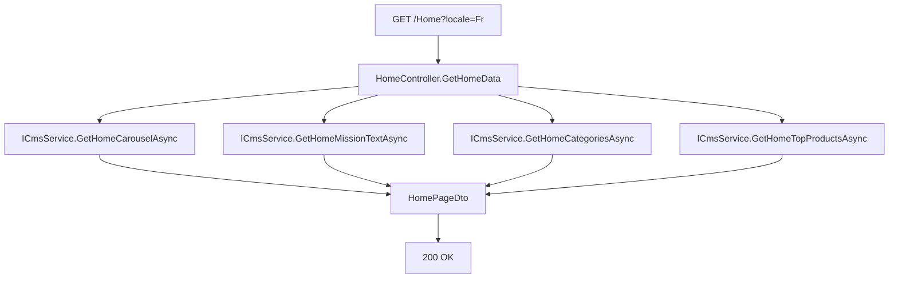

# CMS & Page d'Accueil — Cyna API

## 🎯 Objectif du document

Compléter `Docs/Homepage.md` (document historique) avec une vue consolidée du pattern **BFF (Backend For Frontend)** utilisé par `HomeController`, et les dépendances entre les quatre blocs de contenu agrégés.

---

## 🏠 1. Pattern BFF — une seule requête pour toute la Home

`GET /Home?locale=Fr|En` agrège **quatre sources de données indépendantes** en un seul appel HTTP, pour éviter au frontend de multiplier les requêtes au chargement initial :



Les quatre appels sont **séquentiels** (`await` successifs, pas de `Task.WhenAll`) dans `HomeController.GetHomeData` — chaque source dépend d'un repository différent, donc parallélisables sans risque de conflit. Optimisation possible si la latence cumulée devient un problème (`Task.WhenAll` réduirait le temps de réponse total au plus lent des quatre appels plutôt qu'à leur somme).

---

## 📦 2. Les quatre blocs

| Bloc | Repository source | Règle métier notable |
|---|---|---|
| **Carrousel** | `ICarouselRepository.GetActiveSlidesAsync` | Filtre `IsActive = true`, tri par `DisplayOrder`, traduction filtrée par locale au niveau SQL (`Include(...Where(...))`) |
| **Texte de mission** | `ISiteSettingRepository.GetSettingValueAsync("homepage_mission_text", locale)` | Lecture générique clé-valeur ; `LogWarning` si absent/vide pour la locale demandée |
| **Catégories** | `ICategoryRepository.GetCategoriesAsync` | Triées par `DisplayOrder` ; DTO allégé (`Application.Dto.Home.CategoryDto`, distinct du `Domain.Dto.Category.CategoryDto` utilisé par le module Catégories admin) |
| **Top produits** | `IProductRepository.GetFeaturedProductsAsync(locale, limit=6)` | `IsFeatured = true` **et** `Status = Available`, triés par `CreatedAt` décroissant, inclut uniquement les plans **mensuels** |

### Calcul du "À partir de" (`StartingPrice`)

```csharp
decimal? minPrice = p.PricingPlans
    .SelectMany(plan => plan.PricingTiers)
    .Select(tier => tier.PricePerUnit)
    .DefaultIfEmpty()
    .Min();
...
StartingPrice = minPrice == 0 ? null : minPrice
```

⚠️ Une valeur de `0` est traitée comme **absence de prix** (`null`), pas comme un produit gratuit — à garder en tête si un produit réellement gratuit devait un jour exister dans le catalogue (son prix d'appel n'apparaîtrait pas sur la Home).

### Troncature de description

```csharp
if (!string.IsNullOrEmpty(shortDesc) && shortDesc.Length > 100)
    shortDesc = shortDesc.Substring(0, 97) + "...";
```

Logique identique à celle utilisée pour `ProductSimilarDto` (voir `Docs/ProductDetails-page.md`) — convention partagée de troncature à 100 caractères (97 + `"..."`).

---

## 🧱 3. Pourquoi des DTOs dupliqués entre `Home` et le reste de l'API ?

`Application/Dto/Home/CategoryDto.cs` et `Domain/Dto/Category/CategoryDto.cs` portent **le même nom** mais des structures différentes (le DTO Home est allégé, sans `DisplayOrder`/`ProductCount`/`Translations`). C'est un choix de conception assumé : *« Norme de nommage DTO : DTOs basés sur la structure (ex. `ProductSummaryDto`) plutôt que sur le contexte »* (extrait de `Docs/Homepage.md`).

Cette homonymie est ce qui impose la configuration Swagger :

```csharp
options.CustomSchemaIds(type => type.FullName);
```

Sans cela, Swagger/Scalar lèverait une exception au démarrage (deux schémas de même nom court `CategoryDto`).

---

## ⚠️ 4. Points d'attention

* Les quatre appels au CMS pourraient être parallélisés (`Task.WhenAll`) pour réduire la latence de `/Home`, qui est probablement la route la plus fréquemment appelée (page d'accueil = première requête de chaque session).

---

## 🔗 Documents liés

* `Docs/Homepage.md` *(document historique détaillé, complémentaire à celui-ci)*
* `04-Catalogue-Recherche.md`
* `00-Architecture-Generale.md`