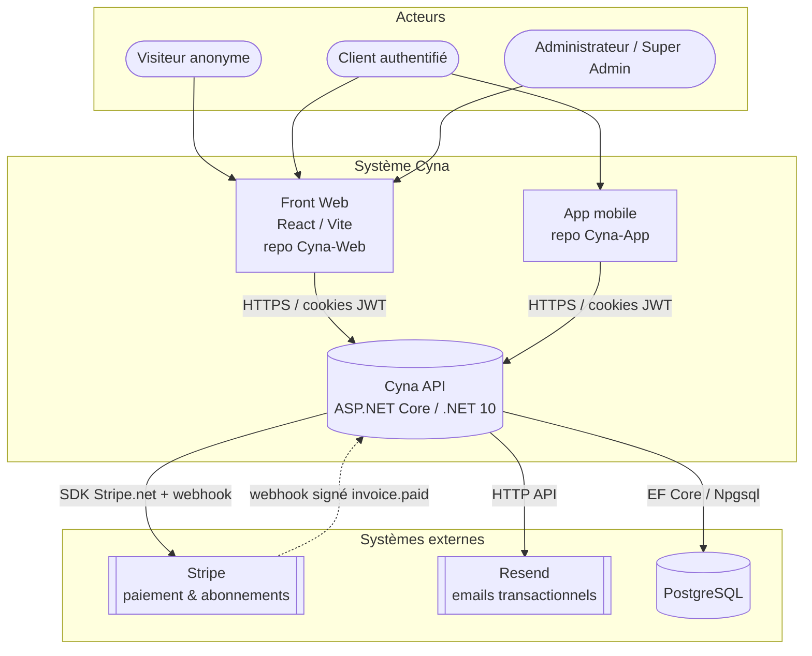
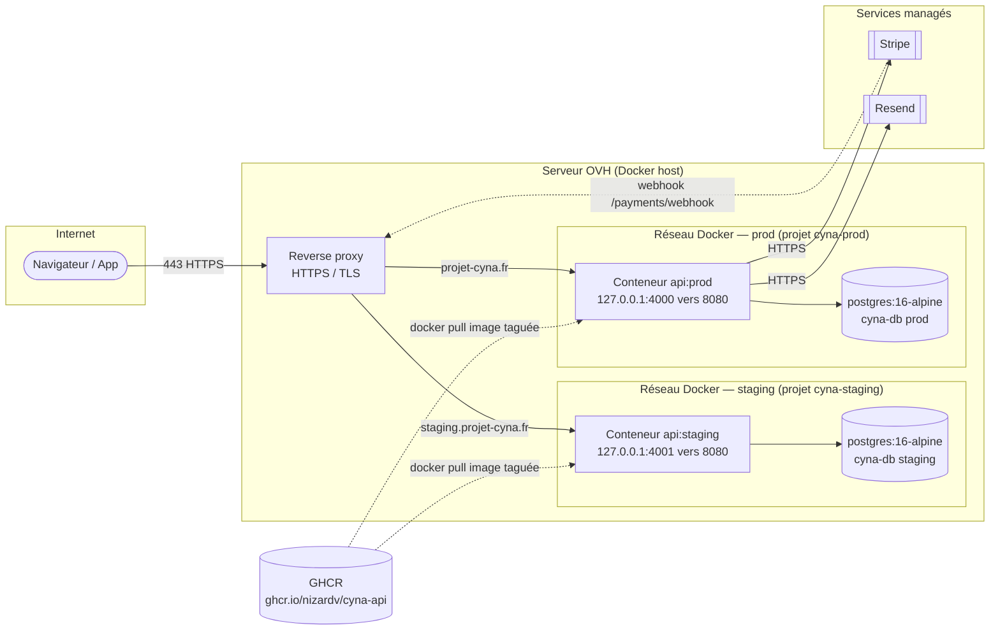
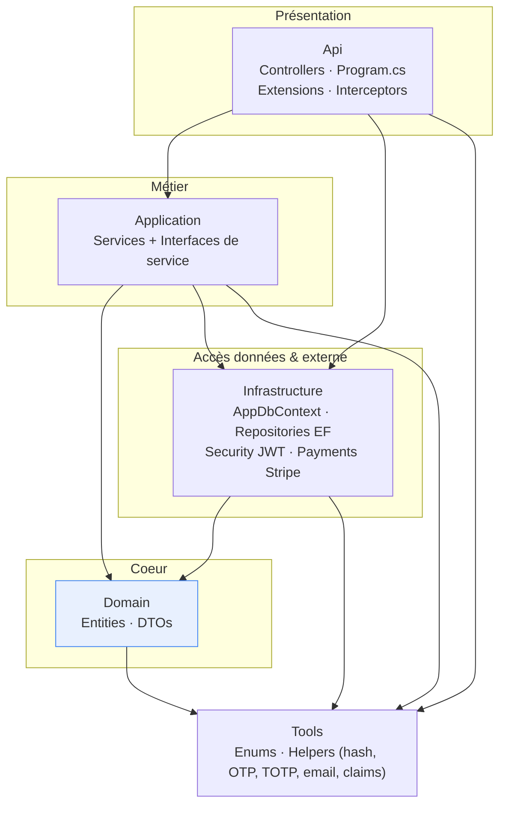
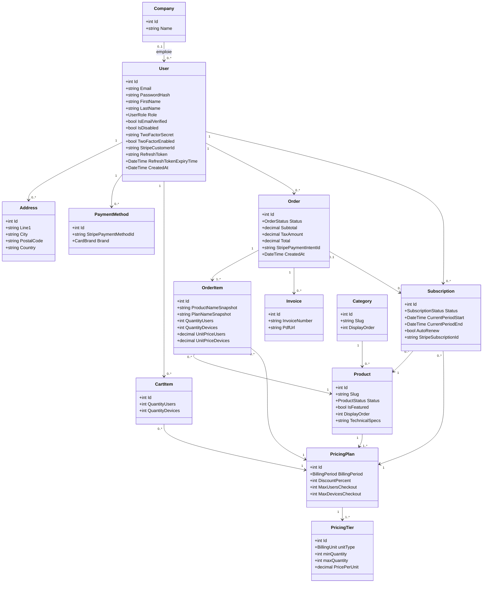
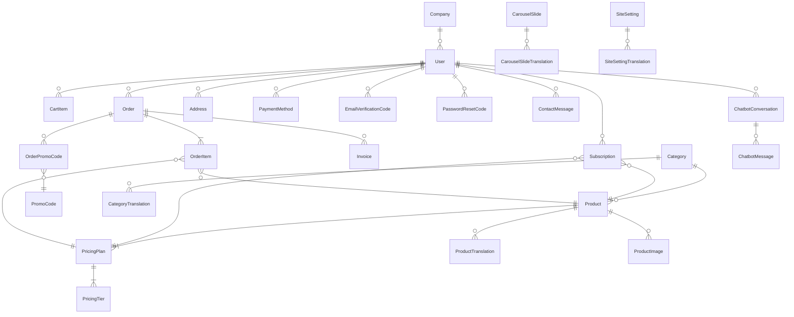
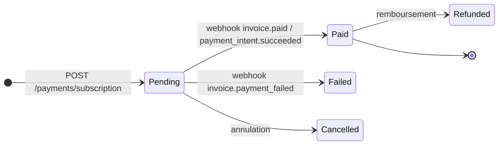
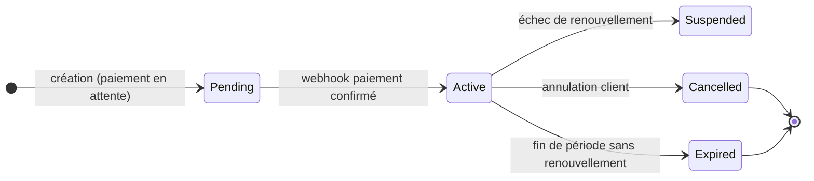
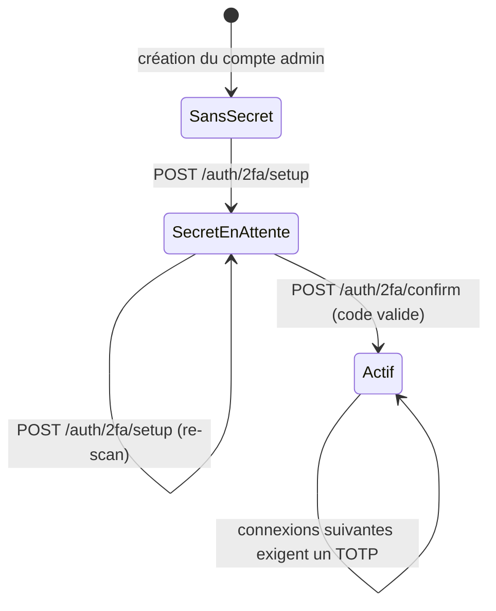

# Schémas Techniques — Cyna API

## 🎯 Objectif du document

Centraliser **tous les schémas techniques** du projet Cyna API en un seul endroit, dans un ordre
qui va du plus large (contexte / déploiement réseau) au plus fin (classes, modèle de données).
Ce document sert de **référence visuelle** : chaque schéma est accompagné d'une légende et d'un
renvoi vers le document fonctionnel qui en détaille la logique.

> Tous les diagrammes sont écrits en **Mermaid** (rendu natif sur Azure DevOps Repos et GitHub).
> Ils sont donc versionnés *as code* : toute évolution du système doit s'accompagner d'une mise à
> jour du diagramme correspondant dans ce fichier.

### Index des schémas

| # | Schéma | Type | Couvre |
|---|---|---|---|
| 1 | Diagramme de contexte | C4 niveau 1 | Acteurs et systèmes externes |
| 2 | Diagramme de déploiement / réseau | Déploiement | Infrastructure, conteneurs, flux réseau |
| 3 | Diagramme de composants (couches) | C4 niveau 2/3 | Projets `.csproj`, dépendances |
| 4 | Diagramme de classes UML (domaine) | UML classes | Entités métier et relations |
| 5 | Modèle physique de données (ERD) | Entité-association | Tables, clés, cardinalités |
| 6 | Index des diagrammes de séquence | UML séquence | Renvois vers les flux détaillés |
| 7 | Diagrammes d'état | UML état | Cycles de vie (commande, abonnement, 2FA) |

---

## 1. 🌍 Diagramme de contexte (C4 — niveau 1)

Vue la plus haute : qui utilise le système, et de quels systèmes externes il dépend.

**Légende** : Cyna API est le **back-end unique** consommé par deux front-ends (web et mobile).
Trois dépendances externes : Stripe (paiement), Resend (email), PostgreSQL (persistance).
Détails dans [`00-Architecture-Generale.md`](00-Architecture-Generale.md).

---

## 2. 🖧 Diagramme de déploiement / réseau

Vue d'exécution : conteneurs, ports, reverse proxy et flux réseau, **reconstituée à partir de
[`docker-compose.yml`](../docker-compose.yml), du pipeline [`cd-cloud-api.yml`](../cd-cloud-api.yml)
et de la configuration CORS de [`Program.cs`](../Api/Program.cs)**.

> ℹ️ Le détail complet de l'infrastructure (Terraform/scripts, reverse proxy, pare-feu, sauvegardes)
> est porté par le dépôt **Cyna-Infra** et sera documenté séparément. Le schéma ci-dessous décrit
> la **vue déploiement côté API**, suffisante pour comprendre comment l'API est exposée et reliée
> à ses dépendances.

### Points clés du déploiement

| Élément | Valeur | Source |
|---|---|---|
| Image runtime | `mcr.microsoft.com/dotnet/aspnet` (.NET 10), build multi-stage | [`Dockerfile`](../Dockerfile) |
| Utilisateur conteneur | **non-root** | `Dockerfile` |
| Port interne API | `8080` (`ASPNETCORE_URLS=http://+:8080`) | `docker-compose.yml` |
| Port exposé prod | `127.0.0.1:4000` (derrière reverse proxy) | `cd-cloud-api.yml` |
| Port exposé staging | `127.0.0.1:4001` | `cd-cloud-api.yml` |
| Base de données | `postgres:16-alpine`, volume `postgres_data` | `docker-compose.yml` |
| Exposition BDD | `127.0.0.1:5432` en local uniquement (jamais publique) | `docker-compose.yml` |
| Registre d'images | GitHub Container Registry (GHCR) | `ci-api.yml` |
| Health check | `GET /health` (validé après chaque déploiement) | `cd-cloud-api.yml` |

> 🔒 La base PostgreSQL n'est **jamais exposée publiquement** : le mapping de port est lié à
> `127.0.0.1`, et l'API la joint par le réseau Docker interne (`Host=db`). Voir
> [`40-Securite-et-Conformite.md`](40-Securite-et-Conformite.md).

### Origines CORS autorisées par environnement

| Environnement | Origines | Détail |
|---|---|---|
| Development | `http://localhost:5173`, `https://localhost:5173` | Front Vite local |
| Staging | `https://staging.projet-cyna.fr` | |
| Production | `https://projet-cyna.fr`, `https://www.projet-cyna.fr` | |

`AllowCredentials()` est activé (transmission des cookies JWT cross-origin).

---

## 3. 🧱 Diagramme de composants (architecture en couches)

Vue interne du back-end : les cinq projets `.csproj` et leur règle de dépendance
(Clean / Onion Architecture). Détail dans [`00-Architecture-Generale.md`](00-Architecture-Generale.md).

**Règle de dépendance** : tout pointe *vers l'intérieur* (`Domain`). `Application` dépend des
**interfaces** de `Infrastructure` (`IUserRepository`, `IPaymentService`…), jamais des
implémentations concrètes — ce qui permet de tester le métier sans base de données et de changer
de fournisseur (SQLite ↔ PostgreSQL, Mock ↔ Stripe).

---

## 4. 🎭 Diagramme de classes UML (domaine)

Vue UML des **principales entités métier** et de leurs associations. Les entités de traduction,
CMS et chatbot sont omises ici pour la lisibilité (présentes dans l'ERD §5). Source :
`Domain/Entities/*`, détail dans [`08-Base-de-donnees.md`](08-Base-de-donnees.md).

> 🔒 Les associations `OrderItem → Product/PricingPlan` et `Subscription → Product/PricingPlan` sont
> configurées en `DeleteBehavior.Restrict` : un produit ou un plan référencé par l'historique
> commercial **ne peut pas être supprimé** (voir [`08-Base-de-donnees.md`](08-Base-de-donnees.md)).

---

## 5. 🗄️ Modèle physique de données (ERD complet)

Vue exhaustive des tables, **y compris** les entités de traduction (i18n), CMS et chatbot.

### Index uniques (rappel)

| Type | Entités concernées |
|---|---|
| Simple | `User.Email`, `Product.Slug`, `Category.Slug`, `Invoice.InvoiceNumber`, `PromoCode.Code`, `Subscription.StripeSubscriptionId`, `PaymentMethod.StripePaymentMethodId`, `SiteSetting.SettingKey` |
| Composite (unicité par locale) | `(CategoryId, Locale)`, `(ProductId, Locale)`, `(SlideId, Locale)`, `(SettingId, Locale)` |

Détail complet : [`08-Base-de-donnees.md`](08-Base-de-donnees.md).

---

## 6. 🔁 Index des diagrammes de séquence

Les diagrammes de séquence détaillés vivent dans les documents fonctionnels concernés (au plus
près de la logique qu'ils décrivent). Récapitulatif :

| Flux | Document |
|---|---|
| Connexion standard (login utilisateur) | [`01-Authentification-JWT-2FA.md`](01-Authentification-JWT-2FA.md) §3 |
| Connexion admin avec 2FA (bootstrap-aware) | [`01-Authentification-JWT-2FA.md`](01-Authentification-JWT-2FA.md) §4 |
| Vérification d'email (OTP) | [`02-Email-OTP.md`](02-Email-OTP.md) §3 |
| Réinitialisation de mot de passe (OTP) | [`02-Email-OTP.md`](02-Email-OTP.md) §4 |
| Paiement par abonnement Stripe (init → webhook) | [`PAIEMENT-STRIPE.md`](PAIEMENT-STRIPE.md) |
| Création de commande | [`05-Panier-Commandes.md`](05-Panier-Commandes.md) §2 |
| Agrégation page d'accueil (BFF) | [`09-CMS-PageAccueil.md`](09-CMS-PageAccueil.md) §1 |

---

## 7. 🔄 Diagrammes d'état (cycles de vie)

### Commande (`Order.Status`)

### Abonnement (`Subscription.Status`)

### 2FA admin (cycle bootstrap)

> Détail des transitions et de la logique « bootstrap » : [`01-Authentification-JWT-2FA.md`](01-Authentification-JWT-2FA.md).

---

## 🔗 Documents liés

* [`00-Architecture-Generale.md`](00-Architecture-Generale.md) — description textuelle de l'architecture
* [`08-Base-de-donnees.md`](08-Base-de-donnees.md) — modèle de données détaillé
* [`50-Scalabilite-et-Performance.md`](50-Scalabilite-et-Performance.md) — vue performance du déploiement
