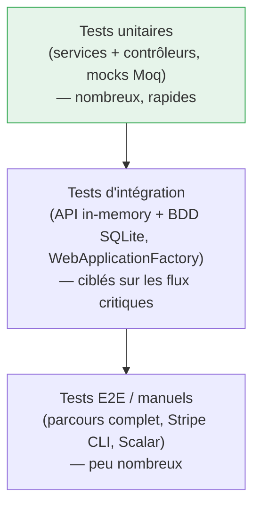
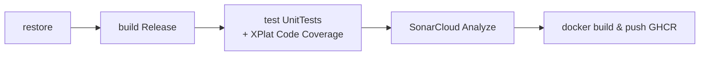

# Stratégie & Résultats de Tests — Cyna API

## 🎯 Objectif du document

Décrire la **stratégie de test** du back-end Cyna (pyramide, types, méthodologie, outillage),
faire l'**inventaire honnête des tests réellement écrits** et de leurs résultats, et présenter le
**plan des tests restant à produire** (intégration, sécurité, performance, résilience).

Ce document tient lieu de **volet « tests » du DAT/DCT** : il relie chaque test à l'exigence
qu'il valide et documente la méthodologie d'exécution.


---

## 1. 🧭 Stratégie de test

### Principe : pyramide des tests

L'effort de test est concentré là où il est le plus rentable, selon la pyramide classique :



| Niveau | Cible | Isolation | Vitesse | Quantité visée |
|---|---|---|---|---|
| **Unitaire** | Logique métier d'un service / contrôleur isolé | Dépendances **mockées** (Moq) | ms | La majorité |
| **Intégration** | Chaîne contrôleur → service → repo → BDD | BDD réelle (SQLite in-memory) + auth simulée | dizaines de ms | Flux critiques (auth, CRUD produit, panier→commande) |
| **E2E / manuel** | Parcours utilisateur réel, paiement | Environnement complet + Stripe CLI | s | Quelques scénarios clés |

### Ce que l'architecture rend testable

Le découpage en couches (voir [`00-Architecture-Generale.md`](00-Architecture-Generale.md)) est
conçu **pour** le test : `Application` dépend d'**interfaces** (`IUserRepository`,
`IPaymentService`…), donc chaque service se teste en injectant des mocks sans base de données.
La passerelle de paiement possède même une implémentation `MockPaymentService` (défaut en
CI/tests) qui supprime toute dépendance réseau à Stripe.

---

## 2. 🧰 Outillage & conventions

| Outil | Rôle |
|---|---|
| **xUnit** | Framework de test (`[Fact]`, assertions) |
| **Moq** | Création de doublures (mocks) des dépendances |
| **Microsoft.AspNetCore.Mvc.Testing** (`WebApplicationFactory`) | Hébergement in-memory de l'API pour les tests d'intégration |
| **coverlet / XPlat Code Coverage** | Mesure de la couverture de code (collectée en CI) |
| **SonarCloud** | Analyse statique + agrégation de la couverture (qualité, code smells, vulnérabilités) |
| **MockPaymentService** | Passerelle Stripe factice — tests sans réseau |
| **Stripe CLI** | Rejeu de webhooks signés pour les tests manuels de paiement |

### Convention AAA (Arrange–Act–Assert)

Tous les tests suivent le découpage **Arrange / Act / Assert**, explicitement commenté :

```csharp
[Fact]
public async Task LoginAsync_WhenUserDoesNotExist_ReturnsError()
{
    // ARRANGE — préparer les données et configurer les mocks
    var request = new LoginRequestDto { Email = "inconnu@test.com", Password = "Password123!" };
    _mockUserRepository.Setup(r => r.GetByEmailAsync(request.Email)).ReturnsAsync((User)null);

    // ACT — exécuter la méthode testée
    var result = await _authService.LoginAsync(request);

    // ASSERT — vérifier le comportement attendu
    Assert.False(result.Success);
    Assert.Equal("Identifiants invalides.", result.ErrorMessage);
}
```

### Nommage

Convention `Méthode_Condition_RésultatAttendu` (ex. `AddToCart_WhenQuantitiesAreZero_ReturnsBadRequest`),
qui rend la liste des tests lisible comme une spécification exécutable.

---

## 3. 🏗️ Infrastructure de test d'intégration

Présente dès maintenant dans `Api.IntegrationTests` (branche `dev`) :

| Fichier | Rôle |
|---|---|
| `CustomWebApplicationFactory.cs` | Démarre l'API en mémoire, substitue la BDD par une instance de test, force `Payments:Provider = Mock` |
| `Auth/TestAuthHandler.cs` | Schéma d'authentification de test injectant un `ClaimsPrincipal` (rôle paramétrable) — permet de tester les routes `[Authorize]` / `AdminOnly` sans passer par un vrai login |

Cette infrastructure est le **socle** sur lequel les tests d'intégration du §5 seront branchés.

---

## 4. ✅ Inventaire des tests unitaires écrits & résultats

**19 tests unitaires**, répartis en 5 classes (branche `test/setup-unit-tests`). Tous suivent le
schéma AAA et utilisent Moq pour isoler la couche testée.

### 4.1 `AuthServiceTests` — 5 tests (service d'authentification)

| Test | Exigence validée | Résultat attendu |
|---|---|---|
| `LoginAsync_WhenUserDoesNotExist_ReturnsError` | Login refusé si email inconnu, message générique | `Success=false`, *« Identifiants invalides. »* |
| `LoginAsync_WhenValidCredentials_ReturnsTokensAndUpdatesUser` | Login OK émet JWT + refresh token et persiste | `Success=true`, token présent, `UpdateAsync` appelé 1× |
| `RegisterAsync_WhenEmailAlreadyExists_ReturnsError` | Pas de doublon d'email ; aucun ajout en base | `Success=false`, `AddAsync` **jamais** appelé |
| `ResetTokenAsync_WhenTokenIsExpired_ReturnsNull` | Refresh refusé si token expiré | `null` (requête bloquée) |
| `LogoutAsync_WhenValidToken_ClearsTokenDataAndReturnsTrue` | Logout invalide le refresh token en base | `RefreshToken=null`, `UpdateAsync` appelé 1× |

### 4.2 `CartServiceTests` — 4 tests (panier & tarification par paliers)

| Test | Exigence validée | Résultat attendu |
|---|---|---|
| `AddOrUpdateCartItemAsync_WhenQuantitiesAreZero_ThrowsArgumentException` | Rejet d'un ajout sans quantité | `ArgumentException` avec message explicite |
| `AddOrUpdateCartItemAsync_WhenPlanNotFound_ThrowsKeyNotFoundException` | Plan tarifaire inexistant | `KeyNotFoundException` contenant « introuvable » |
| `AddOrUpdateCartItemAsync_WhenValid_CalculatesPricesAndTaxCorrectly` | Calcul prix + TVA 20 % | (2×10€)+(3×5€)=35€ ; TVA 7€ ; total 42€ |
| `AddOrUpdateCartItemAsync_WithMultipleTiers_AppliesCorrectTierPrice` | Sélection du bon palier dégressif | 60 unités → prix palier 8€ → ligne 480€ |

### 4.3 `SearchServiceTests` — 3 tests (recherche & pagination)

| Test | Exigence validée | Résultat attendu |
|---|---|---|
| `GetProductsAsync_WithInvalidPagination_UsesDefaultValues` | Normalisation pagination invalide | page `-5`→1, taille `0`→9, `TotalPages≥1` |
| `GetProductsAsync_WithCategoryIdsString_ParsesCorrectly` | Parsing tolérant des IDs CSV | `" 1, bad, 2 , , 3"` → `{1,2,3}` |
| `GetProductsAsync_WithValidData_MapsToDtoAndCalculatesMinPrice` | Mapping DTO + prix mini après remise | 60€ −50 % = 30€ ; 15 items → 2 pages |

### 4.4 `CartControllerTests` — 3 tests (contrôleur panier, traduction exceptions → HTTP)

| Test | Exigence validée | Résultat attendu |
|---|---|---|
| `AddToCart_WhenValidRequest_ReturnsCreated` | Ajout OK | `201 Created` + résultat |
| `AddToCart_WhenQuantitiesAreZero_ReturnsBadRequest` | `ArgumentException` → 400 | `400 BadRequest` |
| `AddToCart_WhenPlanNotFound_ReturnsNotFound` | `KeyNotFoundException` → 404 | `404 NotFound` |

### 4.5 `UserControllerTests` — 4 tests (contrôleur utilisateur)

| Test | Exigence validée | Résultat attendu |
|---|---|---|
| `GetSubscriptions_WhenUserIsAuthenticated_ReturnsOkWithData` | Lecture des abonnements | `200 OK` + liste (2 éléments) |
| `GetSubscriptions_WhenServiceThrowsUnauthorized_ReturnsUnauthorized` | `UnauthorizedAccessException` → 401 | `401 Unauthorized` |
| `GetProfile_WhenUserExists_ReturnsOkWithProfile` | Lecture du profil | `200 OK` + profil |
| `GetProfile_WhenUserDoesNotExist_ReturnsNotFound` | Profil introuvable → 404 | `404 NotFound` |

### Synthèse

| Classe | Tests | Couche | Technique |
|---|---|---|---|
| `AuthServiceTests` | 5 | Service | Moq (`IUserRepository`, `ITokenGenerator`) |
| `CartServiceTests` | 4 | Service | Moq (`ICartRepository`) |
| `SearchServiceTests` | 3 | Service | Moq (`ISearchRepository`) + capture de callback |
| `CartControllerTests` | 3 | Contrôleur | Moq (`ICartService`) + `ControllerContext` simulé |
| `UserControllerTests` | 4 | Contrôleur | Moq (3 services) + `ClaimsPrincipal` simulé |
| **Total** | **19** | | |

---

## 5. 🗺️ Plan des tests d'intégration (à produire)

Branchés sur `CustomWebApplicationFactory` + `TestAuthHandler` (déjà présents). Priorité aux flux
critiques et aux règles de sécurité.

| Suite cible | Cas prioritaires | Exigence |
|---|---|---|
| `ProductCrudTests` | 401 sans auth, 403 non-admin, 201 création, 400 validation, 409 suppression référencée | CRUD produit sécurisé (voir [`ProductAdmin-CRUD.md`](ProductAdmin-CRUD.md)) |
| `AuthFlowTests` | login → /auth/me, refresh, logout, compte désactivé bloqué | Cycle JWT (voir [`01-Authentification-JWT-2FA.md`](01-Authentification-JWT-2FA.md)) |
| `AuthorizationTests` | vérifier le **comportement réel** de `[Authorize(Roles="Admin")]` vs claim `role` (libellé `[Description]`) | Lever l'ambiguïté de nommage des rôles (voir [`06-Categories.md`](06-Categories.md)) |
| `OrderFlowTests` | panier → commande, seuil de devis (quantité > max), snapshot figé | Cycle commande (voir [`05-Panier-Commandes.md`](05-Panier-Commandes.md)) |
| `PaymentWebhookTests` | webhook signé → `Order=Paid` ; signature invalide → 400 ; idempotence | Source de vérité paiement (voir [`PAIEMENT-STRIPE-API.md`](PAIEMENT-STRIPE-API.md)) |

---

## 6. 🔐 Tests de sécurité (plan)

> Voir [`40-Securite-et-Conformite.md`](40-Securite-et-Conformite.md) pour les mesures testées.

| Domaine | Test / vérification | Méthode |
|---|---|---|
| Contrôle d'accès | Chaque route admin renvoie 401/403 sans le bon rôle | Test d'intégration `AuthorizationTests` |
| Dashboard | `DashboardController` **doit** exiger l'authentification (régression du `[Authorize]` commenté) | Test d'intégration dédié |
| Anti-énumération | `/auth/forgot-password` renvoie 200 que l'email existe ou non | Test d'intégration |
| Webhook | Rejet `400` si signature Stripe invalide | Test d'intégration + Stripe CLI |
| Secrets | Absence de secret en clair dans le dépôt | Analyse SonarCloud + revue ; `appsettings.*.json` gitignorés |
| Dépendances | Vulnérabilités connues des paquets NuGet | `dotnet list package --vulnerable` (à ajouter en CI) |
| Analyse statique | Hotspots de sécurité, code smells | **SonarCloud** (déjà en CI) |

---

## 7. ⚡ Tests de performance & résilience (plan)

> Voir [`50-Scalabilite-et-Performance.md`](50-Scalabilite-et-Performance.md).

| Type | Objectif | Outil envisagé | Indicateur |
|---|---|---|---|
| Charge | Tenir N req/s sur `/Home`, `/Search`, `/Catalog` | k6 / Bombardier | p95 latence, taux d'erreur |
| Endurance (soak) | Pas de fuite mémoire sur durée longue | k6 + métriques conteneur | RAM stable |
| Requêtes lentes | Aucune requête > seuil en charge nominale | **`EfSlowQueryInterceptor`** (déjà en place, seuil 200 ms) | Logs requêtes lentes |
| Résilience BDD | Redémarrage Postgres → reconnexion propre | `docker compose restart db` | Reprise sans crash |
| Health | `/health` reflète l'état réel | check post-déploiement (déjà en CD) | 200 OK |

---

## 8. 🔄 Exécution & intégration continue

### En local

```bash
# Tous les tests unitaires
dotnet test UnitTests/UnitTests.csproj

# Tests d'intégration
dotnet test Api.IntegrationTests/Api.IntegrationTests.csproj

# Avec couverture
dotnet test UnitTests/UnitTests.csproj --collect:"XPlat Code Coverage"
```

### En CI (`ci-api.yml`)

Le pipeline exécute, à chaque push sur `main`/`dev` :



> ⚠️ **Point d'amélioration CI** : l'étape `dotnet test` cible aujourd'hui uniquement
> `UnitTests/UnitTests.csproj` et tourne en `continueOnError: true` (un échec de test **ne casse
> pas** le build). Recommandations : (1) ajouter `Api.IntegrationTests` à l'étape de test ;
> (2) retirer `continueOnError` une fois les tests stabilisés pour faire **échouer** la CI sur un
> test rouge ; (3) publier le rapport de couverture comme artefact. Voir
> [`70-Gouvernance-et-Roadmap.md`](70-Gouvernance-et-Roadmap.md).

---

## 9. 📋 Traçabilité tests ↔ exigences (extrait)

| Exigence | Test(s) | Niveau | État |
|---|---|---|---|
| Authentification fiable | `AuthServiceTests` (5) | Unitaire | ✅ Écrit |
| Tarification par paliers correcte | `CartServiceTests` (2 calculs) | Unitaire | ✅ Écrit |
| Recherche robuste (entrées invalides) | `SearchServiceTests` (3) | Unitaire | ✅ Écrit |
| Codes HTTP corrects (panier/user) | `CartControllerTests`, `UserControllerTests` (7) | Unitaire | ✅ Écrit |
| CRUD produit sécurisé | `ProductCrudTests` | Intégration | 🔲 Planifié |
| Paiement = webhook source de vérité | `PaymentWebhookTests` | Intégration | 🔲 Planifié |
| Dashboard protégé | test d'intégration dédié | Intégration | 🔲 Planifié |

---

## 🔗 Documents liés

* [`40-Securite-et-Conformite.md`](40-Securite-et-Conformite.md)
* [`50-Scalabilite-et-Performance.md`](50-Scalabilite-et-Performance.md)
* [`70-Gouvernance-et-Roadmap.md`](70-Gouvernance-et-Roadmap.md)
* [`INSTALLATION.md`](../INSTALLATION.md) — lancement local
