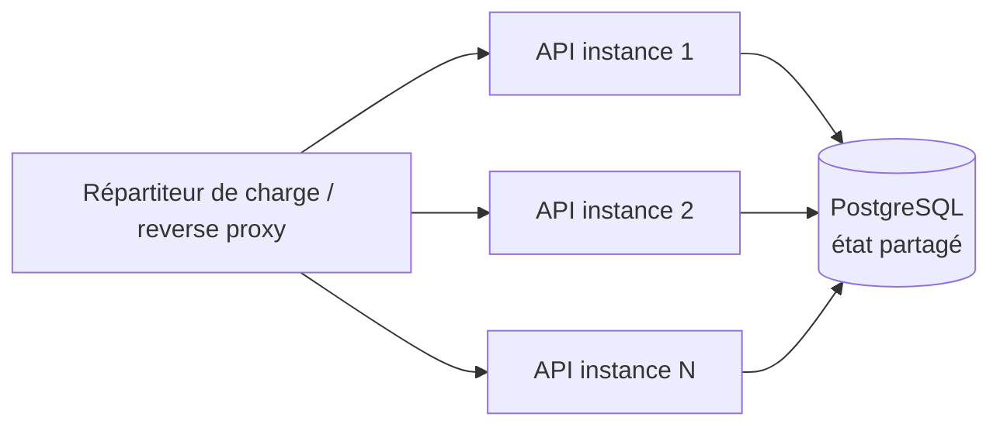

# Scalabilité & Performance — Cyna API

## 🎯 Objectif du document

Documenter les choix qui permettent au back-end Cyna de **monter en charge** et de **rester
performant**, ainsi que les moyens de **supervision (monitoring)** en place et les stratégies
d'**optimisation** et de **gestion des ressources**. On distingue clairement ce qui est **déjà
implémenté** de ce qui est **recommandé** pour une montée en charge future.

---

## 1. 🧩 Conception *scalable by design* : une API sans état (stateless)

Le levier de scalabilité le plus important est architectural : **l'API ne conserve aucun état de
session en mémoire**.

| Choix | Conséquence pour la scalabilité |
|---|---|
| Authentification par **JWT en cookie** (auto-portée) | Aucune session serveur → **n'importe quelle instance** peut traiter n'importe quelle requête |
| Refresh token **persisté en base** (pas en mémoire) | La révocation fonctionne quel que soit le nœud qui répond |
| Aucune donnée applicative en cache mémoire local | Pas de cache à synchroniser entre instances |

> ✅ **Conséquence directe** : on peut lancer **plusieurs réplicas** de l'API derrière un répartiteur
> de charge **sans sticky sessions**. Le passage d'une instance unique à N instances est donc une
> question d'infrastructure, pas de réécriture applicative.



---

## 2. 🐳 Conteneurisation & gestion des ressources

| Élément | Mise en œuvre | Apport |
|---|---|---|
| Image légère | Build multi-stage (.NET 10 SDK → runtime ASP.NET) | Image finale réduite, démarrage rapide |
| Utilisateur non-root | `Dockerfile` | Sécurité + bonne pratique conteneur |
| Politique de redémarrage | `restart: unless-stopped` | Résilience aux crashs |
| Dépendance ordonnée | `depends_on: db (service_healthy)` | L'API ne démarre qu'avec une BDD prête |
| Healthcheck BDD | `pg_isready` (interval 10s) | Détection rapide d'une BDD indisponible |
| Registre d'images | GHCR, images taguées (`prod`, `vX.Y.Z`, `sha-…`) | Déploiement reproductible, rollback par tag |

> 💡 **Recommandation** : déclarer des **limites de ressources** (`deploy.resources.limits`
> cpu/mémoire) dans le `docker-compose` de production pour éviter qu'un conteneur ne consomme toute
> la machine, et calibrer ces limites via les tests de charge (voir [`30-Strategie-et-Resultats-de-Tests.md`](30-Strategie-et-Resultats-de-Tests.md) §7).

---

## 3. 📈 Monitoring & observabilité

### 3.1 Health check (en place)

`GET /health` (`AddHealthChecks` / `MapHealthChecks`) est exposé et **vérifié automatiquement après
chaque déploiement** par le pipeline CD (`curl -f .../health || exit 1`). C'est le signal de base
pour un répartiteur de charge ou un orchestrateur (readiness/liveness probe).

> 💡 **Évolution** : enrichir le health check d'une **vérification de la base** (`AddDbContextCheck`)
> pour distinguer « API up » de « API up **et** BDD joignable ».

### 3.2 Détection des requêtes lentes (en place)

`EfSlowQueryInterceptor` journalise **toute commande SQL dépassant un seuil** configurable
(`EfPerformanceOptions.SeuilMs`, 200 ms par défaut), pour les exécutions sync **et** async
(`Reader`, `NonQuery`, `Scalar`).

```csharp
public class EfPerformanceOptions { public int SeuilMs { get; set; } = 200; }
```

- **Coût nul sur le chemin nominal** : la `StackTrace` n'est capturée *que* si le seuil est dépassé.
- ⚠️ La traçabilité de l'appelant cherche le namespace `Webzine.Repository` (vestige) au lieu de
  `Infrastructure.Repositories` → l'origine est toujours `"inconnu"`. Correctif simple, voir
  [`08-Base-de-donnees.md`](08-Base-de-donnees.md) et le registre [`40-Securite-et-Conformite.md`](40-Securite-et-Conformite.md).

### 3.3 Journalisation (en place)

- Logging ASP.NET Core structuré, niveau par catégorie configurable (`appsettings`).
- En dev/Postgres, `Microsoft.EntityFrameworkCore.Database.Command` en `Information` permet
  d'inspecter le SQL généré.

### 3.4 Pistes d'observabilité (recommandé)

| Besoin | Piste |
|---|---|
| Métriques (req/s, latence, erreurs) | `OpenTelemetry` + Prometheus/Grafana |
| Traçage distribué | `OpenTelemetry` traces |
| Agrégation de logs | Export vers un collecteur (Loki, ELK) |
| Alerting | Seuils sur health/latence/erreurs |

---

## 4. ⚡ Performance applicative

### 4.1 Optimisations déjà en place

| Optimisation | Où | Effet |
|---|---|---|
| **Index** (uniques simples + composites par locale) | `AppDbContext` | Recherches et contraintes d'unicité rapides |
| **Pagination systématique** | Catalogue, recherche, catégories, admin | Pas de chargement de listes complètes |
| **Pattern BFF** sur `/Home` | `HomeController` | **Un seul** appel HTTP agrège 4 blocs (moins d'aller-retours) |
| **Connection pooling** | Chaîne de connexion `Pooling=true` | Réutilisation des connexions Postgres |
| **Projections DTO** | Services / repositories | On ne remonte que les colonnes utiles |
| **Mises à jour ciblées** | `ExecuteUpdateAsync` (changement de rôle), `ExecuteDeleteAsync` (vidage panier) | Pas de round-trip de chargement d'entité |
| **Snapshots** plutôt que jointures à la lecture | `OrderItem` | Lecture d'historique sans recomposer le catalogue |

### 4.2 Optimisations recommandées

| Piste | Gain attendu | Réf. |
|---|---|---|
| `Task.WhenAll` pour les 4 blocs de `/Home` (aujourd'hui séquentiels) | Latence = max(4) au lieu de somme(4) sur la route la plus appelée | [`09-CMS-PageAccueil.md`](09-CMS-PageAccueil.md) |
| **Cache** (mémoire/distribué) sur le catalogue & la Home (données très lues, peu écrites) | Décharge la BDD | — |
| **Compression de réponse** (`UseResponseCompression`) | Réduit la bande passante | — |
| **Rate limiting** sur `/auth/*` | Protège des pics abusifs (double bénéfice sécurité) | [`40-Securite-et-Conformite.md`](40-Securite-et-Conformite.md) SEC-06 |
| Transactions explicites sur la création de commande multi-étapes | Fiabilité (et évite des reprises coûteuses) | [`05-Panier-Commandes.md`](05-Panier-Commandes.md) |

---

## 5. 📦 Scalabilité : état actuel et trajectoire

### 5.1 État actuel

- **Déploiement mono-hôte** (OVH) : une instance API par environnement (prod port 4000, staging 4001),
  derrière un reverse proxy, avec une base Postgres conteneurisée.
- **Scalabilité verticale** immédiate (augmenter les ressources de la VM).

### 5.2 Trajectoire de scalabilité horizontale (l'architecture le permet déjà)

```mermaid
flowchart TB
    subgraph "Étape 1 — actuel"
        A[1 instance API + 1 Postgres]
    end
    subgraph "Étape 2 — réplicas"
        B[N instances API stateless<br/>derrière le reverse proxy]
    end
    subgraph "Étape 3 — orchestration"
        C[Orchestrateur (k8s/Swarm)<br/>auto-scaling sur CPU/req]
        D[Postgres managé + réplicas lecture]
        E[Cache distribué (Redis)]
    end
    A --> B --> C
    B -.-> D
    B -.-> E
```

| Étape | Pré-requis | Déjà satisfait ? |
|---|---|---|
| Plusieurs réplicas derrière un LB | API stateless, refresh en BDD | ✅ Oui (par conception) |
| **Auto-scaling** (horizontal pod/instance autoscaler) | Orchestrateur + métriques (CPU/req/s) | 🔲 À mettre en place (Cyna-Infra) |
| Montée en charge BDD | Postgres managé, réplicas lecture, pooling | ⚠️ Pooling oui ; réplicas à prévoir |
| Cache partagé | Cache distribué (Redis) | 🔲 Recommandé |

> **En résumé** : l'auto-scaling n'est pas encore configuré (il relève de l'infrastructure, gérée
> dans **Cyna-Infra**), mais **aucun verrou applicatif** ne s'y oppose — l'API est conçue pour être
> répliquée. La mise en place concrète de l'auto-scaling et du monitoring infra sera documentée côté
> Cyna-Infra.

---

## 🔗 Documents liés

* [`00-Architecture-Generale.md`](00-Architecture-Generale.md)
* [`08-Base-de-donnees.md`](08-Base-de-donnees.md) — index & intercepteur de requêtes lentes
* [`20-Schemas-Techniques.md`](20-Schemas-Techniques.md) — schéma de déploiement
* [`30-Strategie-et-Resultats-de-Tests.md`](30-Strategie-et-Resultats-de-Tests.md) §7 — tests de performance
* [`70-Gouvernance-et-Roadmap.md`](70-Gouvernance-et-Roadmap.md)
