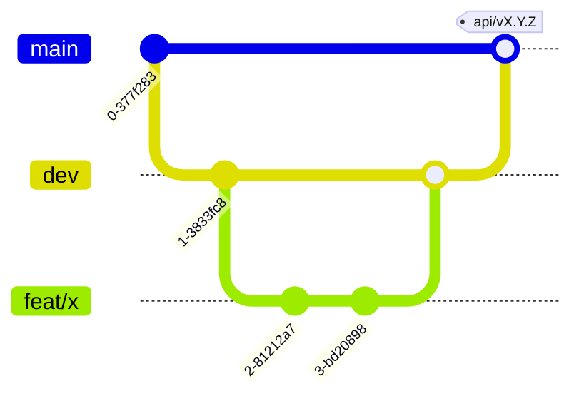
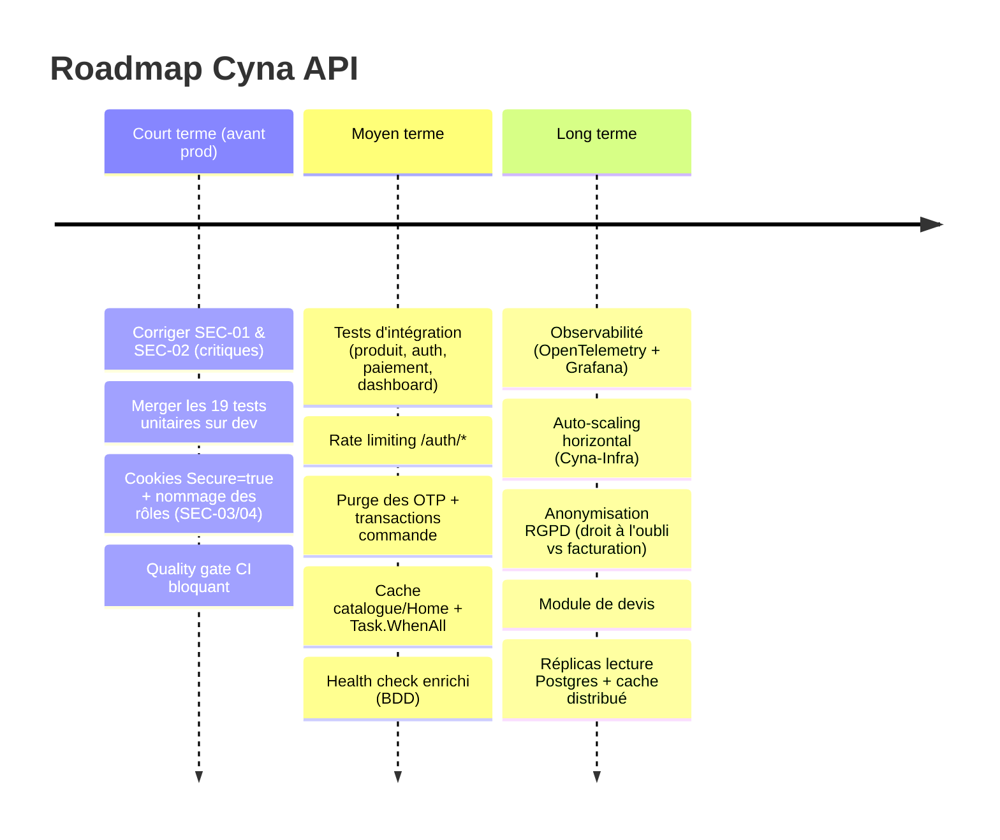

# Gouvernance & Roadmap d'Évolution — Cyna API

## 🎯 Objectif du document

Décrire la **gouvernance technique** du projet (organisation du code, processus de livraison,
qualité), la **gestion de la dette technique**, et la **vision d'évolution** (roadmap de maintenance
et d'amélioration). Ce document répond à la question : *« comment ce système est-il maintenu et où
va-t-il ? »*

---

## 1. 🧭 Gouvernance du code

### 1.1 Organisation Git (branches)

| Branche | Rôle | Déploiement |
|---|---|---|
| `main` | Code de production, stable | → **Production** (OVH:4000) + versioning SemVer |
| `dev` | Intégration continue des fonctionnalités | → **Staging** (OVH:4001) |
| `feat/*` | Développement d'une fonctionnalité | — (mergée dans `dev`) |
| `fix/*` | Correction de bug | — |
| `test/*`, `docs/*` | Tests / documentation | — |

Flux : `feat/*` → **Pull Request** → `dev` (staging) → `main` (production).

### 1.2 Convention de commits & versioning sémantique

- **Commits conventionnels** : `feat:`, `fix:`, `refactor:`, `docs:`, et formes cassantes `feat!:`.
- Le CD calcule automatiquement le **bump SemVer** à partir des messages de commit :
  `feat!:`/`fix!:`/`refactor!:` → **major** ; `feat:` → **minor** ; sinon → **patch**.
- Chaque release produit un **tag Git** `api/vX.Y.Z` et une **image Docker** taguée.

### 1.3 Qualité & intégration continue

| Contrôle | Outil | Quand |
|---|---|---|
| Build Release | `dotnet build` | Chaque push `main`/`dev` |
| Tests | `dotnet test` (+ XPlat Code Coverage) | Chaque push |
| Analyse statique & qualité | **SonarCloud** (`2028DI1P5G3_Cyna-Api`) | Chaque push |
| Style de code | `.editorconfig` versionné | À l'édition / build |
| Build & publication image | Docker → **GHCR** | Chaque push |
| Déploiement + health check | Azure Pipelines → SSH OVH | `dev`→staging, `main`→prod |

> ⚠️ **À durcir** (voir [`30-Strategie-et-Resultats-de-Tests.md`](30-Strategie-et-Resultats-de-Tests.md) §8) :
> l'étape de test est en `continueOnError: true` (un test rouge ne bloque pas le build) et ne cible
> que `UnitTests`. Objectif : **quality gate bloquant** (tests + couverture + Sonar) avant tout merge
> sur `main`.

### 1.4 Documentation comme partie du livrable

La documentation vit dans `Docs/` **dans le dépôt** : versionnée, revue en PR au même titre que le
code. **Règle de gouvernance** : tout changement de comportement métier doit s'accompagner de la mise
à jour du document concerné dans la même PR.

---

## 2. 🧹 Gestion de la dette technique

La dette est **tracée explicitement** (plutôt que dissimulée). Sources : registre de sécurité
[`40-Securite-et-Conformite.md`](40-Securite-et-Conformite.md) §4 + points d'attention des documents
fonctionnels.

### 2.1 Dette de sécurité (prioritaire)
Reprise intégrale du registre **SEC-01 → SEC-10** ([`40-Securite-et-Conformite.md`](40-Securite-et-Conformite.md) §4).
Les deux critiques (SEC-01 dashboard non protégé, SEC-02 paiement non vérifié sur le chemin legacy)
sont **bloquantes** pour une mise en production.

### 2.2 Dette de fiabilité
| Sujet | Détail | Réf. |
|---|---|---|
| Transactions manquantes | Création de commande multi-étapes sans `BeginTransactionAsync` | [05](05-Panier-Commandes.md) / [08](08-Base-de-donnees.md) |
| Palier hors borne → prix 0 € | Quantité non couverte facturée à 0 sans erreur | [05](05-Panier-Commandes.md) |

### 2.3 Dette de maintenabilité (« nettoyage »)
| Sujet | Détail | Réf. |
|---|---|---|
| Namespace `Webzine.Repository` | Vestige dans `EfSlowQueryInterceptor` → traçabilité « inconnu » | [08](08-Base-de-donnees.md) |
| Fichier `Application/Services/temp.cs` vide | À supprimer | [08](08-Base-de-donnees.md) |
| `debug.cs` (`/debug-claims`) | Endpoint de debug à exclure de la prod | [01](01-Authentification-JWT-2FA.md) |
| `AuthService` injecté en double (classe + interface) | Couplage à surveiller pour les tests | [00](00-Architecture-Generale.md) |
| Incohérences de convention HTTP (400 vs 409) entre modules | À harmoniser | [06](06-Categories.md) |
| Slug catégorie mutable (vs produit immuable) | Risque de liens cassés | [06](06-Categories.md) |

---

## 3. 🗺️ Roadmap d'évolution

### 3.1 Court terme — « production-ready » (priorité haute)
1. **SEC-01** : réactiver l'autorisation sur `DashboardController`.
2. **SEC-02** : router tout paiement par le flux Stripe webhook ; déprécier le chemin mock.
3. **SEC-03 / SEC-04** : `Secure=true` sur les cookies, uniformiser le contrôle de rôle sur `AdminOnly`.
4. **Merger** la branche `test/setup-unit-tests` et rendre le **quality gate bloquant**.

### 3.2 Moyen terme — robustesse & performance
- Compléter la **couverture de tests d'intégration** (plan [`30`](30-Strategie-et-Resultats-de-Tests.md) §5/§6).
- **Rate limiting**, **purge OTP**, **transactions** sur la création de commande.
- **Cache** catalogue/Home, parallélisation `/Home`, compression de réponse.
- **Health check** enrichi (vérification BDD), métriques de base.

### 3.3 Long terme — passage à l'échelle & conformité avancée
- **Observabilité** complète (OpenTelemetry, dashboards, alerting).
- **Auto-scaling horizontal** + cache distribué + réplicas lecture (coordonné avec **Cyna-Infra**).
- **Anonymisation RGPD** conciliant droit à l'oubli et conservation comptable.
- **Module de devis** pour les volumes au-delà des paliers.

---

## 4. 🔧 Maintenance courante

| Activité | Fréquence recommandée |
|---|---|
| Mise à jour des dépendances NuGet + scan de vulnérabilités | Mensuelle |
| Revue du registre de sécurité (§ [40](40-Securite-et-Conformite.md)) | À chaque release |
| Vérification des sauvegardes Postgres (restauration testée) | Trimestrielle (Cyna-Infra) |
| Rotation des secrets (JWT, Stripe, Resend, PAT) | Selon politique org. |
| Revue de la couverture de tests | À chaque PR |

---

## 🔗 Documents liés

* [`00-Architecture-Generale.md`](00-Architecture-Generale.md) — build, CI/CD
* [`30-Strategie-et-Resultats-de-Tests.md`](30-Strategie-et-Resultats-de-Tests.md)
* [`40-Securite-et-Conformite.md`](40-Securite-et-Conformite.md) — registre de sécurité
* [`50-Scalabilite-et-Performance.md`](50-Scalabilite-et-Performance.md)
* [`60-Conformite-Cahier-des-Charges.md`](60-Conformite-Cahier-des-Charges.md)
