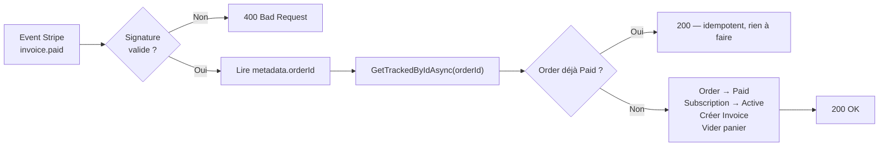

# 💳 Paiement Stripe — Endpoints & Webhook

> ← [Retour à la vue d'ensemble](PAIEMENT-STRIPE.md)

---

## 🧩 Les endpoints

| Méthode | Route | Auth | Rôle |
|---|---|---|---|
| `POST` | `/payments/subscription` | ✅ JWT | Crée la commande `Pending` + le paiement Stripe, renvoie le(s) `clientSecret` |
| `POST` | `/payments/webhook` | ❌ Anonyme | Reçoit les events Stripe (signature vérifiée) → confirme la commande |
| `POST` | `/payments/test/subscription` | ❌ Anonyme *(dev only)* | Abonnement 1 €/mois payé immédiatement avec une carte de test |
| `POST` | `/payments/test/one-time` | ❌ Anonyme *(dev only)* | Achat unique 1 € payé immédiatement avec une carte de test |

### `POST /payments/subscription`

**Requête** — l'adresse seule ; les articles sont lus depuis le panier serveur :
```json
{ "address": { "firstName": "Jean", "lastName": "Dupont", "line1": "12 rue de la Paix",
               "postalCode": "75001", "city": "Paris", "country": "FR" } }
```
**Réponse** :
```json
{
  "orderId": 28,
  "clientSecret": "pi_..._secret_...",
  "clientSecrets": ["pi_..._secret_..."],
  "subscriptionIds": ["sub_..."],
  "publishableKey": "pk_test_..."
}
```

### `POST /payments/webhook`

Endpoint `[AllowAnonymous]` — le corps est lu **brut** (pas de model binding JSON standard),
la signature Stripe est vérifiée avant tout traitement. Voir § Webhook ci-dessous.

### Routes de test (`/payments/test/*`)

Disponibles uniquement si `ASPNETCORE_ENVIRONMENT = Development`. Renvoient `404` en staging/prod.

**Body** :
```json
{ "amountCents": 100, "paymentMethod": "pm_card_visa" }
```

---

## 🪝 Le webhook (source de vérité)

La signature est vérifiée via
`EventUtility.ConstructEvent(json, signature, WebhookSecret, tolérance, throwOnApiVersionMismatch=false)`
— le `throwOnApiVersionMismatch=false` tolère un décalage d'API sans rejeter l'event.

### Events traités

| Event Stripe | Effet en base |
|---|---|
| `invoice.paid` | `Subscription → Active`, `Order → Paid`, crée `Invoice`, vide le panier |
| `payment_intent.succeeded` *(metadata `type=lifetime`)* | `Order → Paid`, crée `Invoice`, vide le panier |
| `invoice.payment_failed` | `Order → Failed` |
| `customer.subscription.updated` | Synchronise le statut de l'abonnement |
| `customer.subscription.deleted` | `Subscription → Cancelled` |

### Réconciliation event → commande locale

Le lien passe par les **métadonnées Stripe** (`orderId` et `pricingPlanId`, stockées dans la
`Subscription` lors de sa création). Lecture via `invoice.Parent.SubscriptionDetails.Metadata`
— sans appel API supplémentaire vers Stripe.



### Idempotence

* `Order → Paid` seulement si la commande n'est pas déjà `Paid`.
* Une seule `Invoice` par commande (`InvoiceExistsForOrderAsync`).
* Les events redélivrés par Stripe sont donc sans effet de bord.
