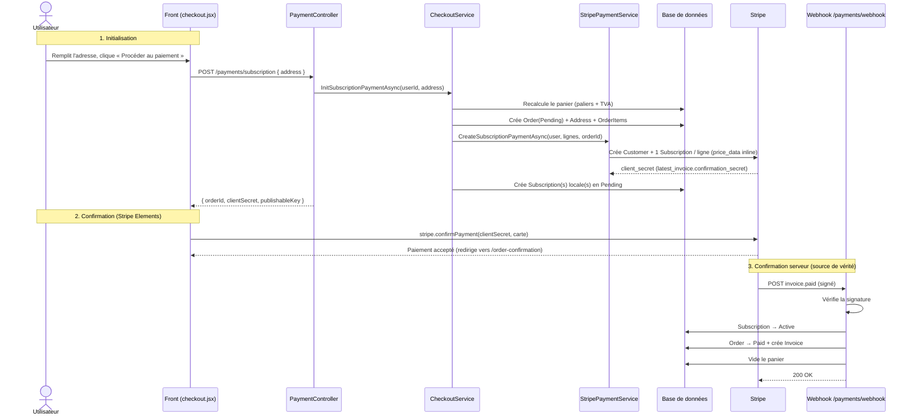
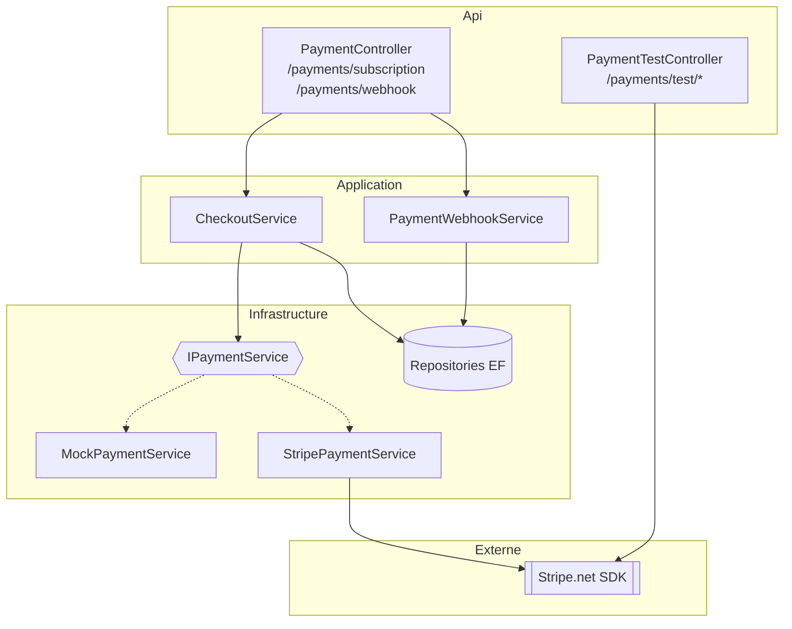
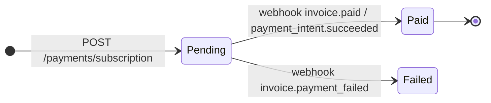

# 💳 Paiement Stripe — Vue d'ensemble

Ce document est le **point d'entrée** de la documentation Stripe. Il couvre la philosophie, le
flux général et l'architecture. Les détails sont dans les fichiers dédiés ci-dessous.

> **En une phrase** : le backend crée la commande en `Pending` + l'abonnement Stripe, le front
> confirme le paiement par carte, et le **webhook Stripe** confirme la commande en `Paid`
> (source de vérité). Une bascule **Mock / Stripe** permet de développer sans connexion réseau.

---

## 🗂️ Table des matières

| Fichier | Contenu |
|---|---|
| **PAIEMENT-STRIPE.md** ← *ici* | Philosophie, flux complet, architecture couches, modèle de données |
| [PAIEMENT-STRIPE-API.md](PAIEMENT-STRIPE-API.md) | Endpoints, webhook (events + idempotence) |
| [PAIEMENT-STRIPE-CONFIG.md](PAIEMENT-STRIPE-CONFIG.md) | Configuration, secrets, Stripe CLI, mise en production, sécurité |
| [PAIEMENT-STRIPE-TEST.md](PAIEMENT-STRIPE-TEST.md) | Guide de test, cartes de test, cheat sheet, limites connues |

---

## 📌 Philosophie & principes de conception

* **Passerelle abstraite (`IPaymentService`)** : toute la mécanique Stripe est cachée derrière une
  interface, avec deux implémentations interchangeables par configuration :
  * `MockPaymentService` → faux identifiants, aucun appel réseau (défaut, dev/CI/tests).
  * `StripePaymentService` → vrais appels Stripe.
  * Bascule via `Payments:Provider` (`"Mock"` | `"Stripe"`).
* **Le webhook est la source de vérité** : une commande n'est jamais marquée `Paid` sur la foi du
  front. Tant que Stripe n'a pas confirmé le paiement (event `invoice.paid` /
  `payment_intent.succeeded`), la commande reste `Pending`. Robuste même si l'utilisateur ferme
  l'onglet.
* **Pending à l'initialisation** : la commande, l'adresse et les abonnements sont créés en base
  **avant** la confirmation, en statut `Pending` — le webhook n'a plus qu'à les faire basculer.
* **Recalcul serveur** : les montants sont **toujours** recalculés côté serveur depuis le panier
  (paliers tarifaires), jamais lus depuis le front.
* **1 ligne récurrente = 1 Subscription Stripe** : mapping 1:1 avec la `Subscription` locale
  (cohérent avec l'index unique `StripeSubscriptionId`). Les lignes « à vie » donnent un
  `PaymentIntent` unique.

---

## 🔄 Le flux de paiement (séquence complète)

---

## 🧱 Architecture par couches

L'intégration respecte la Clean Architecture du projet. `Infrastructure` ne référence pas
`Application` : la passerelle Stripe est donc une **dépendance externe** (au même titre que la BDD),
exposée par une interface dans `Infrastructure.Interfaces`.

### Fichiers clés

| Couche | Fichier | Rôle |
|---|---|---|
| Domain | `Domain/Dto/Payments/` | DTOs (requêtes/réponses, lignes, résultats) |
| Infrastructure | `Infrastructure/Interfaces/IPaymentService.cs` | Contrat de la passerelle |
| Infrastructure | `Infrastructure/Payments/PaymentOptions.cs` | Options `Payments` + `Stripe` |
| Infrastructure | `Infrastructure/Payments/MockPaymentService.cs` | Passerelle factice (défaut) |
| Infrastructure | `Infrastructure/Payments/StripePaymentService.cs` | Passerelle Stripe réelle |
| Application | `Application/Services/CheckoutService.cs` | Recalcul panier + Order Pending + appel passerelle |
| Application | `Application/Services/PaymentWebhookService.cs` | Traitement des events Stripe |
| Api | `Api/Controllers/PaymentController.cs` | Endpoints init + webhook |
| Api | `Api/Controllers/PaymentTestController.cs` | Routes de test (dev only) |
| BDD | Migration `AddUserStripeCustomerId` | Ajout `User.StripeCustomerId` |

---

## 🗃️ Modèle de données & cycle de vie

Champs Stripe en base : `Order.StripePaymentIntentId`, `Subscription.StripeSubscriptionId`
(index unique), `User.StripeCustomerId` (ajouté par migration), entité `Invoice`.

*États `Order` : `Pending → Paid | Failed`. États `Subscription` : `Pending → Active | Cancelled | Suspended`.*
