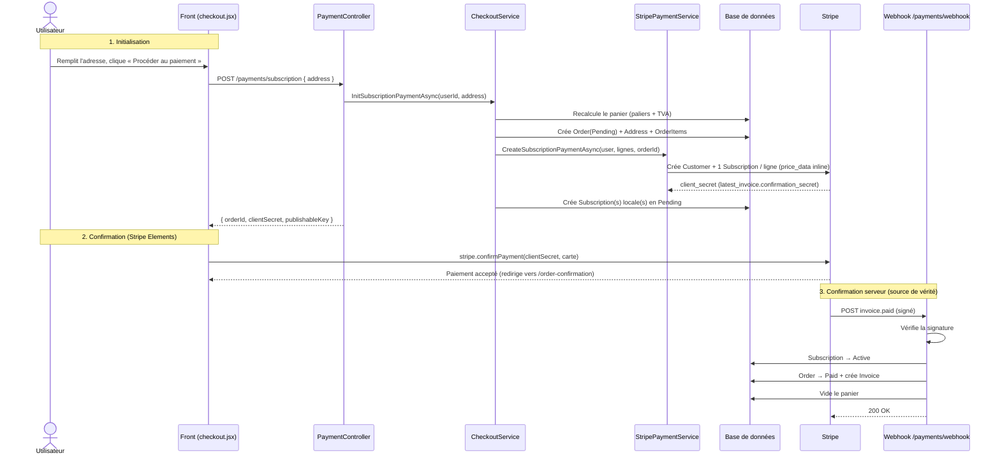
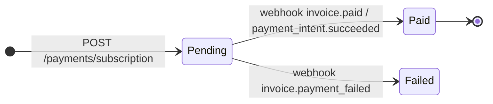

# 💳 Documentation — Paiement Stripe (Backend)

Ce document décrit l'intégration des paiements Stripe dans l'API Cyna : architecture, flux,
couches, endpoints, webhook, configuration et tests.

> **En une phrase** : le backend crée la commande en `Pending` + l'abonnement Stripe, le front
> confirme le paiement par carte, et le **webhook Stripe** confirme la commande en `Paid`
> (source de vérité). Une bascule **Mock / Stripe** permet de développer sans connexion réseau.

---

## 📌 Philosophie & principes de conception

* **Passerelle abstraite (`IPaymentService`)** : toute la mécanique Stripe est cachée derrière une
  interface, avec deux implémentations interchangeables par configuration :
  * `MockPaymentService` → faux identifiants, aucun appel réseau (défaut, dev/CI/tests).
  * `StripePaymentService` → vrais appels Stripe.
  * Bascule via `Payments:Provider` (`"Mock"` | `"Stripe"`).
* **Le webhook est la source de vérité** : une commande n'est jamais marquée `Paid` sur la foi du
  front. Tant que Stripe n'a pas confirmé le paiement (event `invoice.paid` /
  `payment_intent.succeeded`), la commande reste `Pending`. Robuste même si l'utilisateur ferme
  l'onglet.
* **Pending à l'initialisation** : la commande, l'adresse et les abonnements sont créés en base
  **avant** la confirmation, en statut `Pending` — le webhook n'a plus qu'à les faire basculer.
* **Recalcul serveur** : les montants sont **toujours** recalculés côté serveur depuis le panier
  (paliers tarifaires), jamais lus depuis le front.
* **1 ligne récurrente = 1 Subscription Stripe** : mapping 1:1 avec la `Subscription` locale
  (cohérent avec l'index unique `StripeSubscriptionId`). Les lignes « à vie » donnent un
  `PaymentIntent` unique.

---

## 🔄 Le flux de paiement (séquence complète)



---

## 🧱 Architecture par couches

L'intégration respecte la Clean Architecture du projet. `Infrastructure` ne référence pas
`Application` : la passerelle Stripe est donc une **dépendance externe** (au même titre que la BDD),
exposée par une interface dans `Infrastructure.Interfaces`.

```mermaid
flowchart TD
    subgraph Api
        PC[PaymentController<br/>/payments/subscription<br/>/payments/webhook]
        PTC[PaymentTestController<br/>/payments/test/*]
    end
    subgraph Application
        CS[CheckoutService]
        WS[PaymentWebhookService]
    end
    subgraph Infrastructure
        IPS{{IPaymentService}}
        MOCK[MockPaymentService]
        STRIPE[StripePaymentService]
        REPO[(Repositories EF)]
    end
    subgraph Externe
        SDK[[Stripe.net SDK]]
    end

    PC --> CS
    PC --> WS
    CS --> IPS
    CS --> REPO
    WS --> REPO
    IPS -.-> MOCK
    IPS -.-> STRIPE
    STRIPE --> SDK
    PTC --> SDK
```



### Fichiers clés

| Couche | Fichier | Rôle |
|---|---|---|
| Domain | `Domain/Dto/Payments/` | DTOs (requêtes/réponses, lignes, résultats) |
| Infrastructure | `Infrastructure/Interfaces/IPaymentService.cs` | Contrat de la passerelle |
| Infrastructure | `Infrastructure/Payments/PaymentOptions.cs` | Options `Payments` + `Stripe` |
| Infrastructure | `Infrastructure/Payments/MockPaymentService.cs` | Passerelle factice (défaut) |
| Infrastructure | `Infrastructure/Payments/StripePaymentService.cs` | Passerelle Stripe réelle |
| Application | `Application/Services/CheckoutService.cs` | Recalcul panier + Order Pending + appel passerelle |
| Application | `Application/Services/PaymentWebhookService.cs` | Traitement des events Stripe |
| Api | `Api/Controllers/PaymentController.cs` | Endpoints init + webhook |
| Api | `Api/Controllers/PaymentTestController.cs` | Routes de test (dev only) |
| BDD | Migration `AddUserStripeCustomerId` | Ajout `User.StripeCustomerId` |

---

## 🧩 Les endpoints

| Méthode | Route | Auth | Rôle |
|---|---|---|---|
| `POST` | `/payments/subscription` | ✅ JWT | Crée la commande `Pending` + le paiement Stripe, renvoie le(s) `clientSecret` |
| `POST` | `/payments/webhook` | ❌ Anonyme | Reçoit les events Stripe (signature vérifiée) → confirme la commande |
| `POST` | `/payments/test/subscription` | ❌ Anonyme *(dev only)* | Abonnement 1 €/mois payé immédiatement avec une carte de test |
| `POST` | `/payments/test/one-time` | ❌ Anonyme *(dev only)* | Achat unique 1 € payé immédiatement avec une carte de test |

### `POST /payments/subscription`

**Requête** — l'adresse seule ; les articles sont lus depuis le panier serveur :
```json
{ "address": { "firstName": "Jean", "lastName": "Dupont", "line1": "12 rue de la Paix",
               "postalCode": "75001", "city": "Paris", "country": "FR" } }
```
**Réponse** :
```json
{
  "orderId": 28,
  "clientSecret": "pi_..._secret_...",
  "clientSecrets": ["pi_..._secret_..."],
  "subscriptionIds": ["sub_..."],
  "publishableKey": "pk_test_..."
}
```

---

## 🪝 Le webhook (source de vérité)

Endpoint `[AllowAnonymous]` qui lit le **corps brut**, vérifie la signature via
`EventUtility.ConstructEvent(json, signature, WebhookSecret, tolérance, throwOnApiVersionMismatch=false)`,
puis dispatche.

| Event Stripe | Effet en base |
|---|---|
| `invoice.paid` | `Subscription → Active`, `Order → Paid`, crée `Invoice`, vide le panier |
| `payment_intent.succeeded` *(metadata `type=lifetime`)* | `Order → Paid`, crée `Invoice`, vide le panier |
| `invoice.payment_failed` | `Order → Failed` |
| `customer.subscription.updated` | Synchronise le statut de l'abonnement |
| `customer.subscription.deleted` | `Subscription → Cancelled` |

**Réconciliation** : le lien event → commande locale passe par les **métadonnées Stripe**
(`orderId`, lues sur `invoice.Parent.SubscriptionDetails.Metadata` — sans appel API supplémentaire)
et par l'`StripeSubscriptionId` (index unique).

**Idempotence** :
* `Order → Paid` seulement si la commande n'est pas déjà `Paid`.
* Une seule `Invoice` par commande (`InvoiceExistsForOrderAsync`).
* Les events redélivrés par Stripe sont donc sans effet de bord.

---

## ⚙️ Configuration & secrets

```jsonc
// appsettings.json (versionné — valeurs non secrètes / placeholders vides)
"Payments": { "Provider": "Mock", "Currency": "eur" },
"Stripe":   { "SecretKey": "", "PublishableKey": "", "WebhookSecret": "" }
```

| Clé | Où la mettre | Source |
|---|---|---|
| `Stripe:SecretKey` (`sk_test_…`) | `appsettings.Development.json` (gitignoré) / env var | Dashboard → API keys |
| `Stripe:PublishableKey` (`pk_test_…`) | idem | Dashboard → API keys |
| `Stripe:WebhookSecret` (`whsec_…`) | idem | `stripe listen` (local) ou Dashboard → Webhooks (serveur) |

> ⚠️ **Jamais** de clé dans `appsettings.json` (versionné). Les vraies clés vivent dans
> `appsettings.Development.json` (gitignoré), `appsettings.Staging/Production.json` (gitignorés)
> ou des variables d'environnement.

**Bascule Mock ↔ Stripe** : `Payments:Provider`. Le DI (`AppServicesExtensions`) enregistre
l'implémentation correspondante ; `Mock` reste le défaut sûr.

---

## 🗃️ Modèle de données & cycle de vie

Champs Stripe en base : `Order.StripePaymentIntentId`, `Subscription.StripeSubscriptionId`
(index unique), `User.StripeCustomerId` (ajouté par migration), entité `Invoice`.


*États `Order` : `Pending → Paid | Failed`. États `Subscription` : `Pending → Active | Cancelled | Suspended`.*

---

## 🧪 Guide de test (mode test Stripe)

1. `appsettings.Development.json` → `Payments:Provider = "Stripe"` + clés `sk_test_` / `pk_test_`.
2. Webhook local :
   ```
   stripe listen --forward-to https://localhost:7169/payments/webhook
   ```
   → copier le `whsec_…` dans `Stripe:WebhookSecret`, relancer l'API.
3. Test rapide via Swagger/Scalar — routes `payments/test/*`, body :
   ```json
   { "amountCents": 100, "paymentMethod": "pm_card_visa" }
   ```

| `paymentMethod` | Résultat |
|---|---|
| `pm_card_visa` / `pm_card_mastercard` / `pm_card_amex` | ✅ `succeeded` |
| `pm_card_chargeDeclined` | ❌ `declined` (`generic_decline`) |
| `pm_card_chargeDeclinedInsufficientFunds` | ❌ `insufficient_funds` |
| `pm_card_authenticationRequired` | 🔐 `requires_action` (3DS) |

> Numéros de carte (front Elements) : `4242 4242 4242 4242` (succès), `4000 0000 0000 9995`
> (fonds insuffisants), `4000 0025 0000 3155` (3DS). Date future + CVC quelconques.

---

## 🚀 Mise en production

* **Pas de `stripe listen`** en déployé : on enregistre l'endpoint dans le **Dashboard → Webhooks**
  avec l'URL publique HTTPS (`https://.../payments/webhook`) ; Stripe pousse directement les events.
* Chaque environnement (dev local, staging, prod) a **son propre endpoint + son propre `whsec_`**.
* Le `WebhookSecret` du serveur va en **variable d'environnement** (`Stripe__WebhookSecret`).
* L'endpoint doit être **public et en HTTPS** (Stripe refuse le http).

---

## 🔒 Sécurité

* Signature du webhook **toujours vérifiée** (`whsec_`) → rejet `400` si invalide.
* Montants **recalculés côté serveur** — le front ne peut pas imposer un prix.
* Endpoint webhook `[AllowAnonymous]` mais protégé par la signature ; aucun autre endpoint de
  paiement n'est anonyme (hors routes de test, **dev only**, qui renvoient `404` en production).
* Clés secrètes hors du dépôt.

---

## ⚠️ Limites connues & évolutions

| Sujet | État actuel | Évolution possible |
|---|---|---|
| Produits Stripe | Créés à la volée (dédup intra-requête) | Persister `Product.StripeProductId` |
| TVA | 20 % calculé par ligne | Stripe Tax |
| Panier multi-périodicités | Plusieurs `clientSecret` (front gère le 1er) | Confirmation séquentielle côté front |
| Commande `Pending` orpheline | Possible si l'appel Stripe échoue après création locale | Job de nettoyage des `Pending` expirés |
| Codes promo | Non appliqués au montant Stripe | Intégration `coupons` Stripe |
| Gestion abonnement | Pas d'annulation côté user | Portail client Stripe |

---

## 📋 Cheat sheet

| Besoin | Commande |
|---|---|
| Démarrer l'API (https) | `dotnet run --project Api --launch-profile https` |
| Démarrer + re-seed | `dotnet run --project Api -- --seed` |
| Build complet | `dotnet build CynaApi.sln` |
| Écouter les webhooks | `stripe listen --forward-to https://localhost:7169/payments/webhook` |
| Payer un PI de test | `stripe payment_intents confirm pi_XXX --payment-method pm_card_visa` |
| Migration EF (⚠️ provider Postgres) | `DatabaseProvider=postgres ConnectionStrings__DefaultConnection="Host=localhost;Database=cyna;Username=postgres;Password=postgres" dotnet ef migrations add <Nom> -p Infrastructure -s Api` |
| User de test | `teststripe@cyna.fr` / `Test123!` |
| Plan mensuel de test | `pricingPlanId = 1` |
